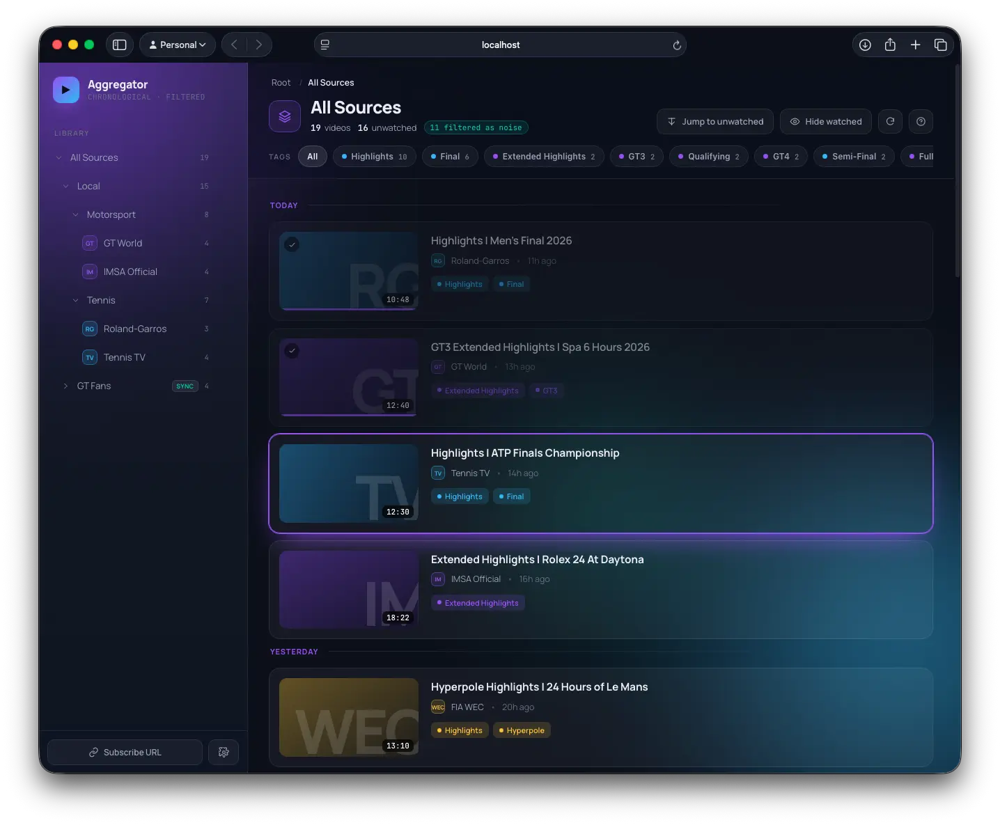
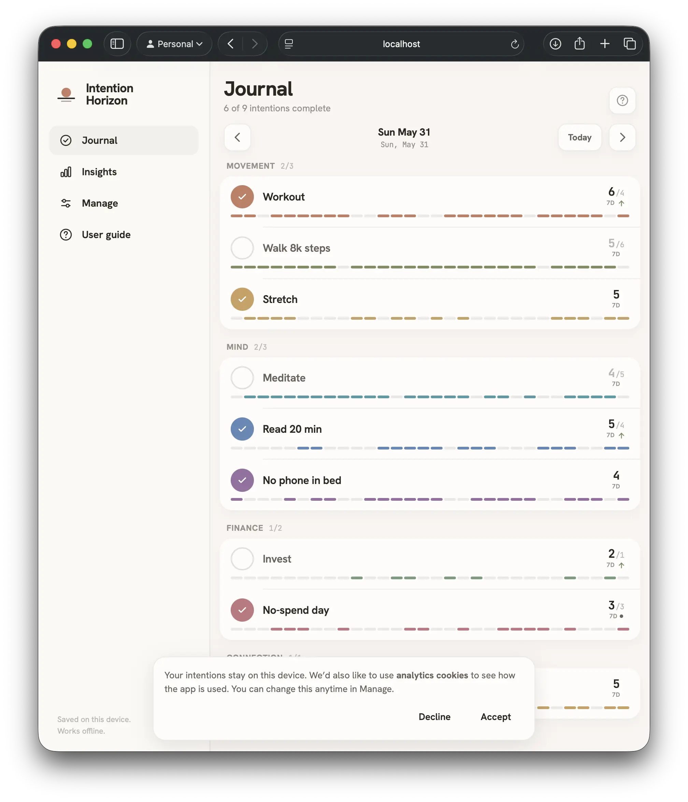
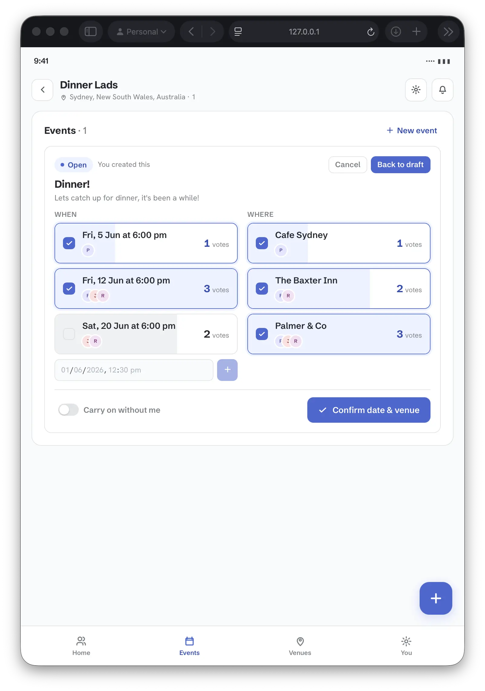
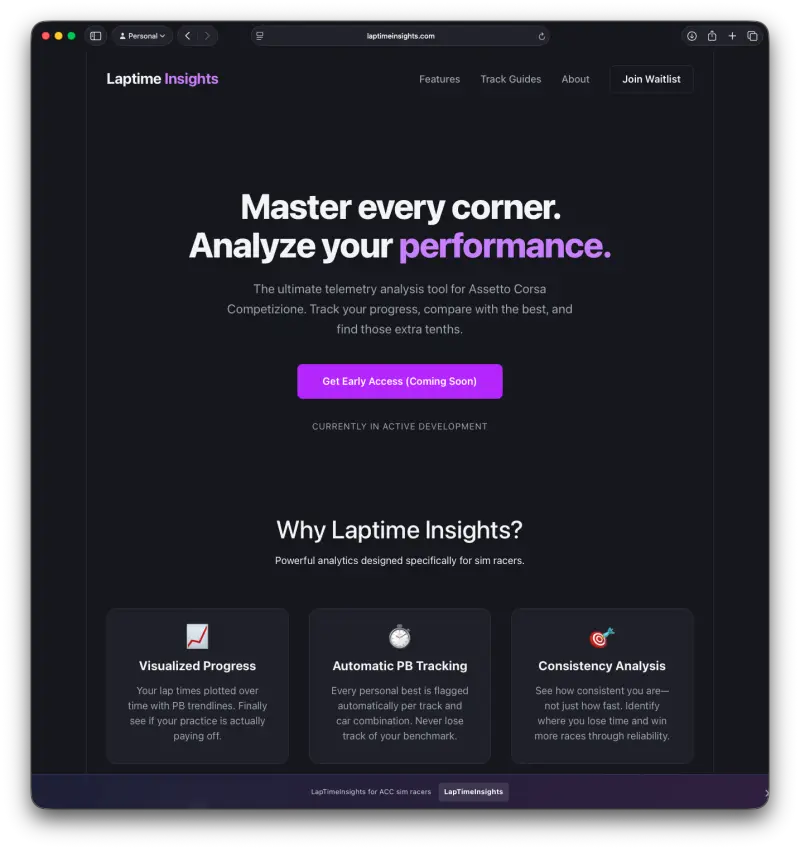
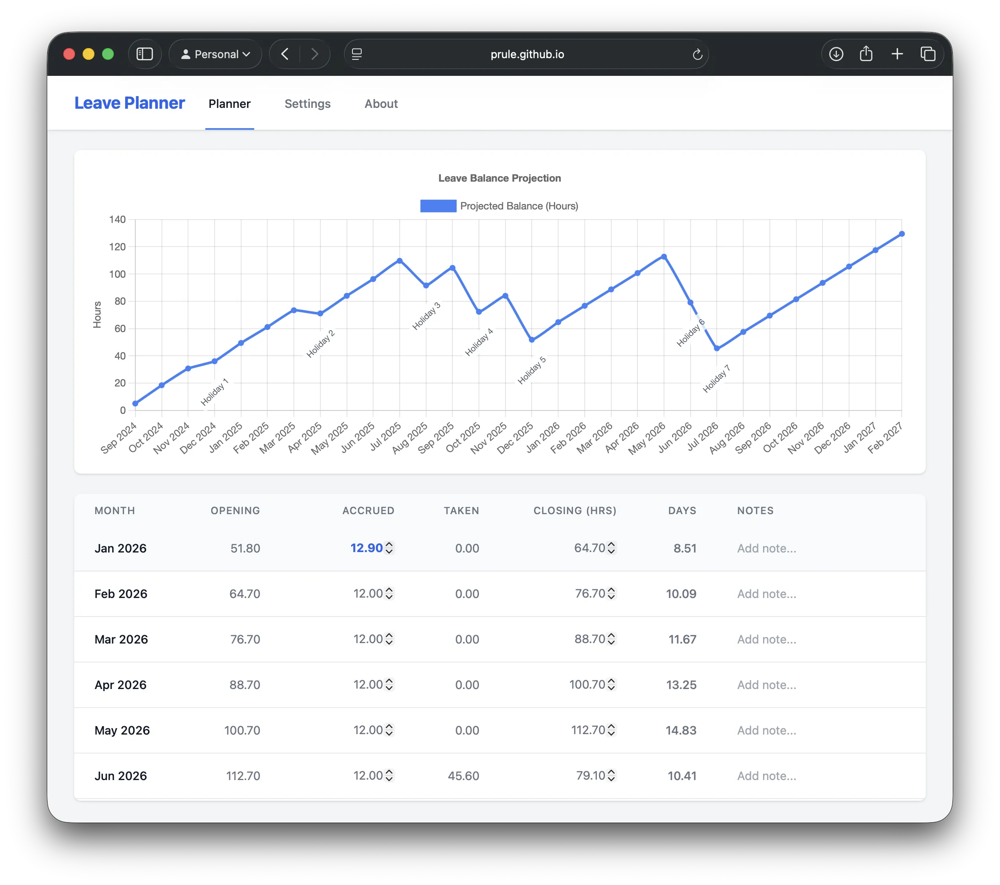
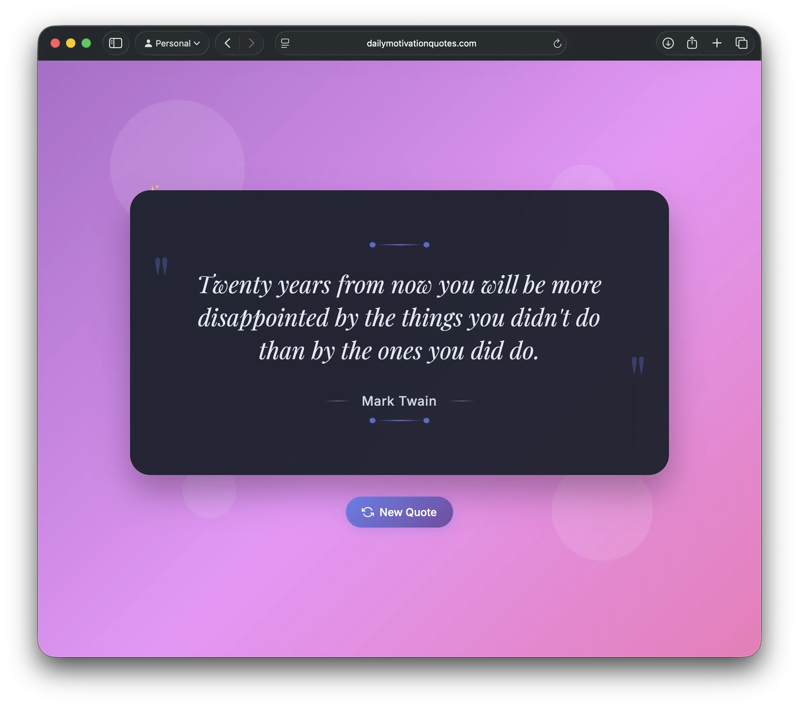
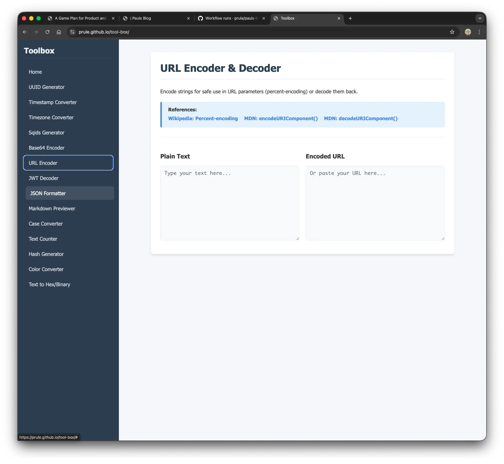

## GitHub

https://github.com/prule

- [Laptime Insights (WIP)](https://github.com/prule/laptime-insights-server)
  + Current project in progress to show a dashboard for ACC laptimes. Practice clean architecture, integration with sim racing software, kotlin/ktor/exposed/websockets.
- [Banking example](https://github.com/prule/bank-example/tree/v2-openspec-claude)
  + An experiment with AI coding using OpenSpec.
- [Data processing experiment](https://github.com/prule/data-processing-experiment/tree/latest)
  + A coding exercise, design challenge, documentation workout - follows the incremental design and implementation of a configurable data processing pipeline. Each part is in its own branch with its own documentation - be sure to look at the branch "latest" for the end result.
- [Rest/Hateoas example](https://github.com/prule/rest-hateoas)
  + A sample project to demonstrate a rest api with resources containing links to drive the frontend.
  + Also see https://github.com/prule/spring-boot-react-hateoas-template/tree/material-ui-spike (the main branch is out of date, look at the material-ui-spike branch)
- [Jsonata-java fork](https://github.com/prule/jsonata-java/tree/bigdecimal-experiment)
  + Fork of the jsonata-java library to use BigDecimal instead of float in order to solve the binary arithmetic problem (e.g. https://stackoverflow.com/questions/588004/is-floating-point-math-broken).

----

## Blog

https://prule.github.io/pauls-blog/

----

## Video aggregator

Gives you a chronological, filtered YouTube feed instead of an algorithmic one. Organize subscriptions under Sources → Topics → Channels, apply hierarchical include/exclude rules, and
pivot your timeline by auto-matched tags.

----

## Intention Horizon

A local-first habit tracker: define intentions, group them by category, tick them off each day, and watch your count move against a target you set — N completions over M days.

----

## Catchup

Catchup helps groups of friends coordinate social catch-ups — proposing dates, voting on venues, and locking in events — without the chaos of group messaging.

----

## Laptime Insights

https://laptimeinsights.com

> Coming soon...

----

## Leave planner

https://prule.github.io/leave-planner/

> Plan your annual leave with ease.

----

## Create and Share Custom Countdown Timers Online

https://mycountdownto.com

> From weddings and birthdays to product launches and holidays, our free online countdown creator lets you build and share beautiful, animated timers in seconds. Customize backgrounds, choose the perfect font, and share a link with anyone, on any device.

----

## Daily motivation quotes

https://www.dailymotivationquotes.com

----

## Toolbox

https://prule.github.io/tool-box/

