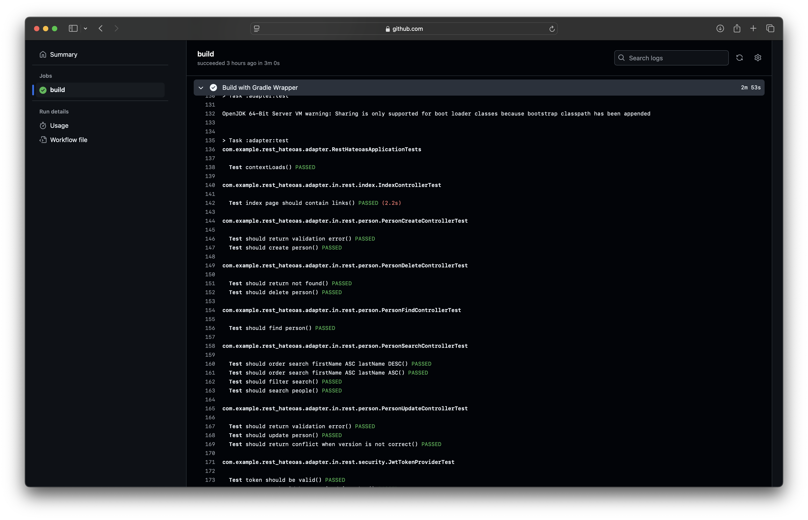
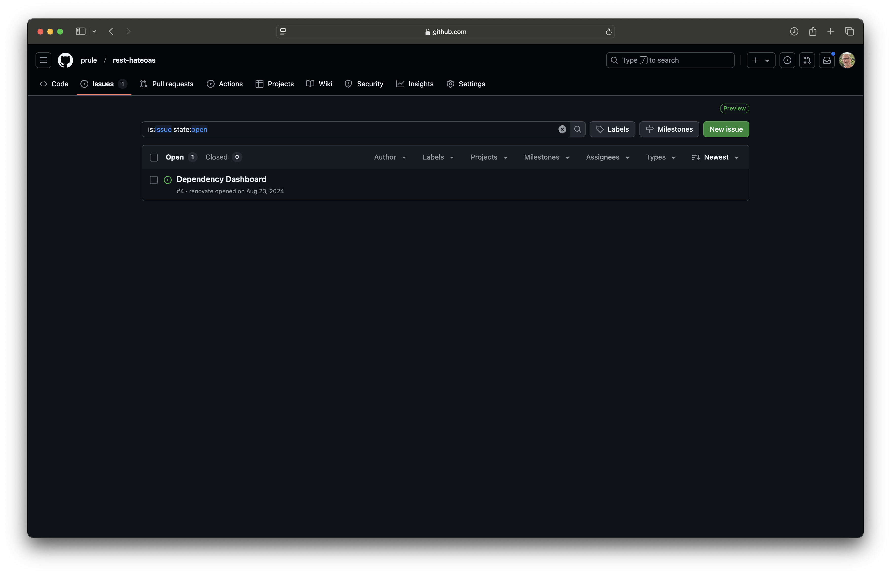

In modern software development, managing dependencies is a critical yet often overlooked aspect of maintaining healthy codebases. Enter Renovate: an open-source tool that automates dependency updates, making your project maintenance both easier and more secure.

## What is Renovate?

Renovate is an automated dependency management tool that monitors your repository's dependencies and automatically creates pull requests when updates become available. Think of it as your personal assistant that constantly checks for new versions of the libraries and packages your project uses.

## Why Your Team Needs Renovate

### 1. Security Through Timeliness
Outdated dependencies are security vulnerabilities waiting to happen. Renovate ensures you're promptly notified of security patches and updates, allowing you to maintain a secure codebase proactively rather than reactively.

### 2. Reduced Manual Work
Gone are the days of manually checking for updates or running `npm audit` periodically. Renovate automates this process, creating pull requests that:
- Update dependencies to their latest versions
- Include release notes and changelogs
- Can be configured to auto-merge for minor updates

### 3. Gradual Updates
Instead of facing a mountain of outdated dependencies every few months, Renovate helps you stay current through small, manageable updates. This approach:
- Reduces the risk of breaking changes
- Makes debugging easier when issues occur
- Keeps technical debt from accumulating

## Getting Started

Setting up Renovate is straightforward:

1. Install Renovate in your repository (through GitHub App or self-hosted)
2. Add a basic configuration file (renovate.json)
3. Let Renovate create its first "onboarding" pull request

A minimal configuration might look like this:

```json
{
  "$schema": "https://docs.renovatebot.com/renovate-schema.json",
  "extends": ["config:base"]
}
```

## Best Practices

To get the most out of Renovate, consider these best practices:

- Start with the default configuration and customize gradually
- Use preset configurations for your specific ecosystem
- Configure auto-merging for patch updates
- Set up scheduled updates to avoid overwhelming your CI pipeline
- Group related dependencies to minimize PR noise

## Example

Here's a simple example of a Renovate configuration file:

.renovate.json5 configuration
[source,json5]
----
include::./renovate.json5[]
----

Key points to note:

* Scheduled to run on Monday mornings
** Conveniently runs before the workday starts, leaving pipeline capacity free for your team when they need it most
** Also helps if you have automated deployments - less interruption/change during your work day
* Groups minor and patch updates together into one PR
** This reduces the number of PRs and makes it easier to review and minimises noise
** example: https://github.com/prule/rest-hateoas/pull/54
* Automatically merges minor/patch updates (if CI checks pass)
** This helps keep the repository up-to-date without manual intervention - less PRs to review!

Example pull requests from one of my repositories:

- https://github.com/prule/rest-hateoas/pulls?q=is%3Apr+is%3Aclosed+renovate

You'll want to have CI checks configured so that Renovate can merge PRs automatically. I use a github action to run `./gradlew build` to ensure the project compiles and passes all tests:

Github action to build project
[source,yml]
----
include::./gradle.yml[]
----

example: https://github.com/prule/rest-hateoas/actions/runs/13094941863/job/36536104338

.Github build output


If the build fails with compile errors or tests failing, Renovate will not merge the PR, and you'll need to fix the issue and merge the PR manually.

In some corporate environments you may have standards for branch naming and commit messages. You can configure Renovate to use a specific branch name and commit message format using the `branchPrefix`, `prHeader` and `commitMessage` options.

See https://docs.renovatebot.com/configuration-options/ for more details.

To get started with Renovate on Github, follow the instructions on the official documentation: https://docs.renovatebot.com/getting-started/installing-onboarding/#hosted-githubcom-app

Once up and running, you'll see an issue in your repository with a link to the Renovate dashboard:

.Renovate dashboard


If you view the dashboard, you'll see a checkbox that lets you trigger renovate to run again on the repository:

.Renovate dashboard detail
image::./renovate-dashboard-detail.png[Renovate dashboard detail]

This is particularly useful if you've changed the configuration and don't want to wait for the next scheduled run.

So there it is! Keep your dependencies up to date with Renovate. It's a great way to keep your codebase healthy and your team productive.
