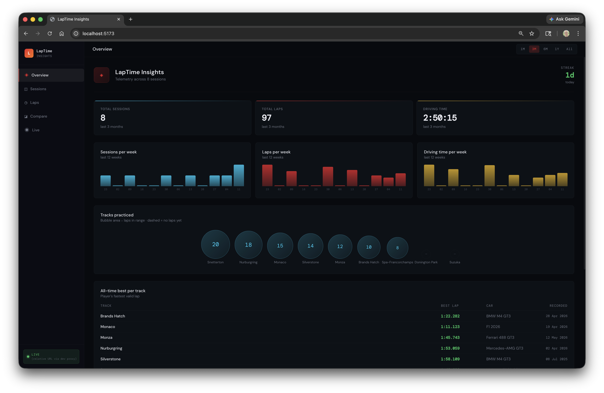
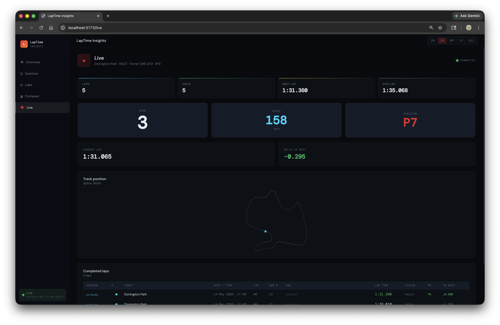
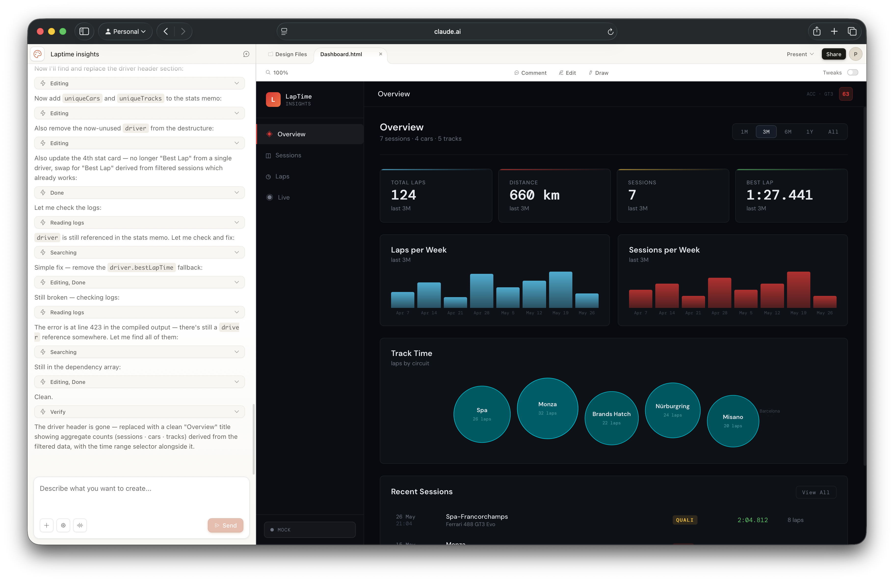

Building useful software is the best way to learn. Building useful software *for a problem you actually have* is even better.

I race in Assetto Corsa Competizione. I wanted a proper dashboard for analysing lap times. So I started building one.

## The Real Goal

Two goals, really. First: something genuinely useful. Second: a vehicle for practising software development - and increasingly, for understanding how AI tools fit into a real workflow.

## Starting by Hand

I started without AI assistance. Not as a purity exercise - there's just value in setting up the structure yourself. I built the backend framework manually: REST APIs, search criteria, HATEOAS capability, the architectural patterns I wanted to follow. Getting the skeleton right before handing anything off matters.

This is how I think about it: AI tools can fill in a structure. They can't design one for you - or at least, you don't want them to. The patterns and decisions you establish early will shape everything that follows.

## Bringing in Claude Code

Once the framework was in place, I started using Claude Code to flesh things out. This is where it gets interesting.

The experience is genuinely different from writing everything by hand. It's not just faster - it changes *what* you can attempt. Tasks that would have been tedious enough to skip become tractable. The shape of the work shifts.

What held up well: the architecture I'd established upfront. Claude Code can generate a lot of code quickly, but it generates *into* whatever structure is already there. A clean architecture with clear boundaries gave it useful constraints to work within.

## AI for the Frontend

The frontend UI was handled by AI design tooling. I'm a backend developer - I can build a UI, but it's not where I want to spend time on a side project. Using AI to prototype and iterate on the frontend let me stay focused on the parts I find more interesting.

The split works well: backend structure and logic by hand, frontend by AI. Clear division of labour.

## Simulator First

Something I've written about before: build a simulator. Before testing against real ACC telemetry, I built a simulator that emits the same data. This means I can run and test the application without launching the game.

On a project like this, it's the difference between a tight development loop and a frustrating one.

## Going Further: gRPC and Protobuf

Here's where the "learning" goal takes over from the "useful" goal.

I could have made the simulator controllable several ways - a simple HTTP endpoint, a CLI flag, anything. Instead I added a gRPC client so I can start and stop sessions programmatically. The practical benefit is the same as any other approach. The real reason: I wanted to work with protobuf.

This is a pattern I'd encourage. A side project is a safe place to try things that are overkill for the actual problem. The problem gives you something real to implement against. The implementation gives you genuine experience with the technology. You learn more from building something slightly overengineered for fun than from following a tutorial.

## What's Next

Next I'm planning to try OpenSpec and OpenCode - AI-assisted development harnesses that take a different approach to the workflow. I'm interested in how these tools affect the development process at a higher level: planning, spec-driven work, the feedback loop between intent and implementation.

More on that once I've had time to work with them properly.

## The Broader Point

This project is a useful lens for something I think about a lot: how do AI tools actually fit into a real development workflow?

My take so far: they're most useful when you've already done the thinking. The architecture, the patterns, the decisions about what matters - that's still your job. What AI tools do well is execution within a clear structure. The more clearly you've thought through what you're building, the better the results.

Establishing the backend framework manually before using Claude Code wasn't a workaround - it was the right approach. The AI filled in a structure I'd designed. That's a good use of the tool.

---

*Code is on [GitHub](https://github.com/prule/laptime-insights-server). More on this project as it develops.*

