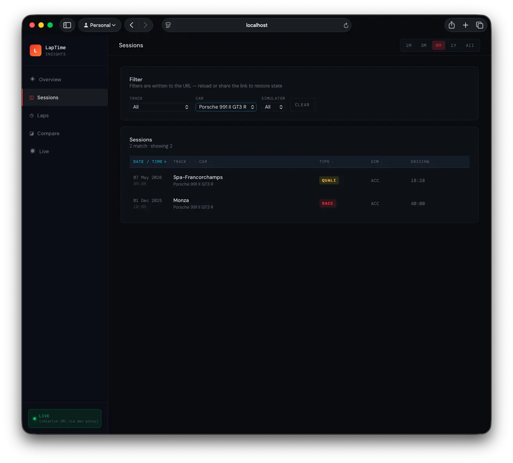
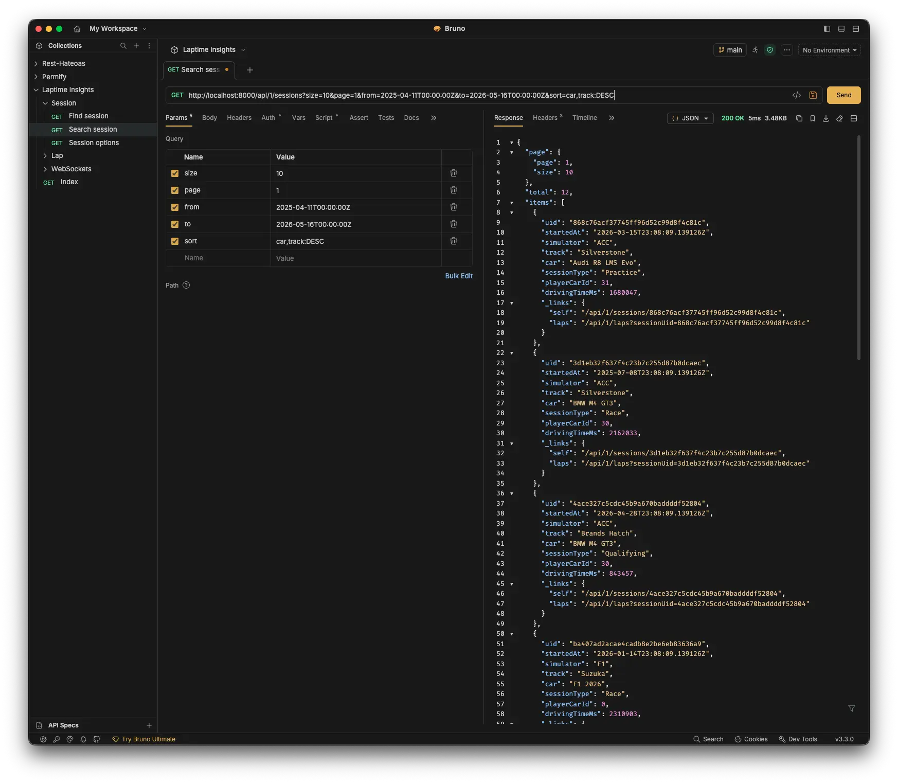
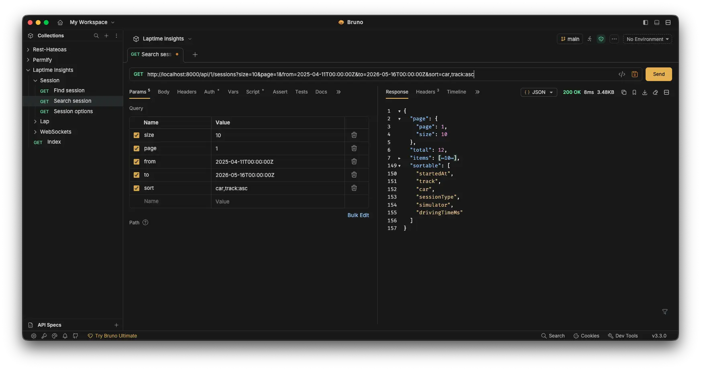

# Anatomy of a Search Endpoint: Filter, Sort, Paginate, HATEOAS

A walk through `GET /api/1/sessions` in the Laptime Insights server — from the Ktor route, down through the use case and persistence port, into the Exposed query, and back out as a HATEOAS page that the React frontend uses to render a sortable table.

The feature is small but it touches every layer, so it's a good example of how clean architecture lets each concern live in exactly one place: the domain decides what's sortable, the repository decides how that maps to a column, the resource decides how it appears on the wire, and the UI decides how to render it. Nothing leaks.

---

## What the endpoint does

The shape is conventional:

```
GET /api/1/sessions?track=Snetterton%20Circuit&simulator=ACC
                   &from=2026-04-11T00:00:00Z
                   &sort=startedAt:DESC
                   &page=1&size=25
```

The response is a paged envelope with HATEOAS-y `_links` on each item plus a `sortable` array describing which fields the client may pass to `sort`:

```json
{
  "page": { "page": 1, "size": 25 },
  "total": 142,
  "items": [
    {
      "uid": "9b3f…",
      "startedAt": "2026-04-12T18:03:11Z",
      "simulator": "ACC",
      "track": { "value": "Snetterton Circuit" },
      "car": { "value": "Ferrari 296 GT3" },
      "sessionType": { "value": "Race" },
      "playerCarId": 17,
      "drivingTimeMs": 1894200,
      "_links": {
        "self": "/api/1/sessions/9b3f…",
        "laps": "/api/1/laps?sessionUid=9b3f…"
      }
    }
  ],
  "sortable": ["startedAt", "track", "car", "sessionType", "simulator", "drivingTimeMs"]
}
```

That `sortable` array is the load-bearing detail. The frontend doesn't hard-code which columns are sortable — it reads them off the response and lights up the right column headers. Backend and frontend stay in sync without anyone updating a shared constant.

---

## Layer 1 — Routes (Ktor Resources)

Paths are declared as `@Resource` data classes rather than string literals. This lets us type-safely build URLs elsewhere (`application.href(SessionRoutes.SessionId(uid = ...))`), which is how the link factory avoids hard-coding `/api/1/...` strings.

```kotlin
// adapter/in/web/session/SessionRoutes.kt
@Serializable
@Resource("/api/1/sessions")
data class SessionRoutes(val dummy: String? = null) {
  @Serializable
  @Resource("/options")
  data class Options(val parent: SessionRoutes = SessionRoutes())

  @Serializable
  @Resource("/{uid}")
  data class SessionId(val parent: SessionRoutes = SessionRoutes(), val uid: String)
}
```

---

## Layer 2 — Controller (REST adapter)

The controller is the thinnest layer: parse, delegate, respond. It also describes itself via the Ktor OpenAPI `describe { }` DSL so `/openapi` and `/swaggerUI` pick it up.

```kotlin
// adapter/in/web/session/SearchSessionController.kt
get<SessionRoutes> {
  call.respond(
    searchSessionUseCase
      .searchSessions(
        SessionSearchCriteria.fromParameters(call.request.queryParameters),
        call.request.toPageRequest(),
        call.request.toSort(),
      )
      .map { SessionResource.fromDomain(it, SessionLinkFactory(application)) }
      .withSortable(Session.SORTABLE_FIELDS)
  )
}
```

Three parsers turn the querystring into domain inputs: a `SessionSearchCriteria` (the *what*), a `PageRequest` (the *how much*) and a `Sort` (the *in what order*). The use case answers with a `Page<Session>`, the controller maps each `Session` to a `SessionResource`, then tags the page with the domain's sortable-field list. That tag is what the frontend will use to decide which headers are clickable.

### Parsing the criteria

`SessionSearchCriteria` is a domain value object — pure Kotlin, no Ktor, no Exposed. The parser lives in the web layer as an extension function so the domain class stays unaware of HTTP:

```kotlin
fun SessionSearchCriteria.Companion.fromParameters(parameters: Parameters): SessionSearchCriteria {
  return SessionSearchCriteria(
    car = parameters["car"]?.let { Car(it) },
    track = parameters["track"]?.let { Track(it) },
    simulator = parameters["simulator"]?.let { Simulator.valueOf(it) },
    from = parameters["from"]?.let { Instant.parse(it) },
    to = parameters["to"]?.let { Instant.parse(it) },
    uid = parameters["uid"]?.let { Uid(it) },
    id = parameters["id"]?.let { SessionId(it.toLong()) },
  )
}
```

### Parsing page and sort

The page and sort parsers are shared across endpoints — they hang off `RoutingRequest` so any controller can call them. The `sort` parameter accepts either a single `field:DIR` pair or a comma-separated list for multi-column ordering:

```kotlin
// adapter/in/web/RoutingRequestExtension.kt
fun RoutingRequest.toSort(): Sort {
  val raw = queryParameters["sort"] ?: return Sort.noSort()
  val parts = raw.split(",").map { it.trim() }.filter { it.isNotEmpty() }.map {
    val (field, direction) = it.split(":", limit = 2).let { p ->
      if (p.size == 2) p[0].trim() to p[1].trim() else p[0].trim() to "ASC"
    }
    SortBy(field, Order.valueOf(direction.uppercase()))
  }
  return if (parts.isEmpty()) Sort.noSort() else Sort(parts)
}
```

Direction is case-insensitive so `desc` and `DESC` both work. Unknown field names are deliberately *not* rejected here — that decision lives further down, where field-to-column mapping happens.

---

## Layer 3 — Domain declares what's sortable

This is where clean architecture earns its keep. The domain model owns the canonical list of sortable fields — not the controller, not the repository:

```kotlin
// application/domain/model/Session.kt
companion object {
  /**
   * Field names a client may pass in the `sort` query parameter of `GET /api/1/sessions`. The
   * persistence adapter (`SessionEntity.sortableFields`) maps each name to its Exposed column;
   * the search controller surfaces this list on the page response so the UI knows which table
   * columns to render as sortable.
   */
  val SORTABLE_FIELDS: List<String> =
    listOf("startedAt", "track", "car", "sessionType", "simulator", "drivingTimeMs")
}
```

Why put it on the domain? Because sortability is a domain concern. "What does it make sense to order sessions by?" is a question the domain can answer without knowing anything about HTTP, SQL, or React. The same field names then surface in two places: in the response (so the UI can introspect them) and in the entity's persistence mapping (so they can be translated to columns).

The criteria object itself is equally persistence-agnostic:

```kotlin
// application/domain/model/SessionSearchCriteria.kt
data class SessionSearchCriteria(
  val id: SessionId? = null,
  val uid: Uid? = null,
  val car: Car? = null,
  val track: Track? = null,
  val simulator: Simulator? = null,
  val from: Instant? = null,
  val to: Instant? = null,
) : SearchCriteria { companion object }
```

Nullable fields combine with logical AND: `null` means "don't constrain this dimension." This is a small but useful contract — it means the same criteria type drives `/sessions`, `/sessions/options`, and `/sessions/aggregate`, each one filtering a different aggregate down through the same predicates.

---

## Layer 4 — Use case (port in)

The use case is an interface declaring the operation in domain terms:

```kotlin
// application/port/in/session/SearchSessionUseCase.kt
interface SearchSessionUseCase {
  fun searchSessions(
    criteria: SessionSearchCriteria,
    pageRequest: PageRequest,
    sort: Sort,
  ): Page<Session>
}
```

Its implementation does almost nothing — wrap the call in an Exposed transaction and delegate to the port:

```kotlin
// application/domain/service/session/SearchSessionService.kt
class SearchSessionService(private val searchSessionPort: SearchSessionPort) : SearchSessionUseCase {
  override fun searchSessions(
    criteria: SessionSearchCriteria,
    pageRequest: PageRequest,
    sort: Sort,
  ): Page<Session> = transaction { searchSessionPort.search(criteria, pageRequest, sort) }
}
```

The thinness is the point. The service is the seam where transactions, authorisation, or cross-aggregate orchestration would land if they were needed. Right now they aren't, so it stays a one-liner.

---

## Layer 5 — Port out and persistence adapter

The outbound port `SearchSessionPort` declares what the application needs from persistence in domain terms. The adapter implements it on top of Exposed, calling into a repository and mapping entities to domain objects:

```kotlin
// adapter/out/persistence/session/SessionPersistenceAdapter.kt
override fun search(
  criteria: SessionSearchCriteria,
  pageRequest: PageRequest,
  sort: Sort,
): Page<Session> {
  return repository.search(criteria, pageRequest, sort).map(mapper::toDomain)
}
```

The mapper translates the row into a properly typed domain `Session` — wrapping primitives like `String` in `Track`, `Car`, `Uid` value objects so the rest of the codebase never handles bare strings.

---

## Layer 6 — Building the query

The repository owns three concerns: WHERE construction, ORDER BY translation, and LIMIT/OFFSET.

### WHERE — criteria to predicates

A single `toQuery()` extension turns the criteria into an Exposed `Query`. Each filter is independent and contributes a single `andWhere`:

```kotlin
fun SessionSearchCriteria.toQuery(): Query {
  val query = SessionTable.selectAll()

  id?.let { query.andWhere { SessionTable.id eq it.value } }
  uid?.let { query.andWhere { SessionTable.uid eq it.value } }
  car?.let { query.andWhere { SessionTable.car eq it.value } }
  track?.let { query.andWhere { SessionTable.track eq it.value } }
  simulator?.let { query.andWhere { SessionTable.simulator eq it.name } }

  from?.let { query.andWhere { SessionTable.startedAt greaterEq it } }
  to?.let { query.andWhere { SessionTable.startedAt lessEq it } }

  return query
}
```

This `toQuery()` is reused by `options()` and `aggregate()` on the same repository: every endpoint that takes the criteria sees the same filtered set. If a new filter needs to be added (say, `sessionType`), it goes in here once and every consumer picks it up.

### Field-to-column mapping

The repository maps the domain's sortable-field names to Exposed columns. This is the only place the two vocabularies meet:

```kotlin
// adapter/out/persistence/session/SessionEntity.kt
val sortableFields = SortableFields(
    mapOf(
      "startedAt"     to SessionTable.startedAt,
      "track"         to SessionTable.track,
      "car"           to SessionTable.car,
      "sessionType"   to SessionTable.sessionType,
      "simulator"     to SessionTable.simulator,
      "drivingTimeMs" to SessionTable.drivingTimeMs,
    )
  )
  .also {
    require(it.mapping.keys == Session.SORTABLE_FIELDS.toSet()) {
      "SessionEntity.sortableFields keys ${it.mapping.keys} must match " +
        "Session.SORTABLE_FIELDS ${Session.SORTABLE_FIELDS}"
    }
  }
```

That `require { }` is a small but important safety net. The domain's `SORTABLE_FIELDS` is the public contract — it's what the UI sees. If someone adds a field to the domain list but forgets to wire it to a column (or removes a column without updating the domain list), the class fails to initialise. The mismatch can't reach production and lurk as a 500 the first time someone clicks the column header.

### Sort, paginate, count

Sort translation and pagination are factored into a reusable `paginate` extension on `Query`. Anything not in `sortableFields` is silently dropped — by the time bad field names reach here they're already past the public contract:

```kotlin
// utils/.../exposed/QueryExtension.kt
fun <T> Query.paginate(
  pageRequest: PageRequest,
  sort: Sort,
  sortableFields: SortableFields,
  transform: (ResultRow) -> T,
): Page<T> {
  val total = count()

  val order = sort.fields
    .mapNotNull {
      sortableFields.mapping[it.field]?.let { col -> col to SortOrder.valueOf(it.order.name) }
    }
    .toTypedArray()

  if (order.isNotEmpty()) orderBy(*order)

  val results = limit(pageRequest.size)
    .offset(((pageRequest.page - 1) * pageRequest.size).toLong())
    .toList()

  return Page(pageRequest, total, results.map(transform))
}
```

`count()` runs first against the filtered query and gives the total used for pagination UI. Then `orderBy` is applied, then `limit/offset` for the page slice. Two round trips, one for the count, one for the page — straightforward, and Exposed handles the dialect-specific SQL.

The repository's `search()` is then just plumbing:

```kotlin
// adapter/out/persistence/session/SessionRepository.kt
override fun search(
  criteria: SessionSearchCriteria,
  pageRequest: PageRequest,
  sort: Sort,
): Page<SessionEntity> {
  return criteria.toQuery().paginate(pageRequest, sort, SessionEntity.sortableFields) {
    SessionEntity.wrapRow(it)
  }
}
```

---

## Layer 7 — Resources and HATEOAS

`SessionResource` is the wire shape. It's deliberately not the domain object: it strips internal ids, formats `drivingTime` as plain milliseconds, and embeds `_links`:

```kotlin
@Serializable
data class SessionResource(
  val uid: Uid,
  val startedAt: Instant?,
  val simulator: Simulator,
  val track: Track?,
  val car: Car?,
  val sessionType: SessionType,
  val playerCarId: Int?,
  val drivingTimeMs: Long,
  val _links: Map<String, String>,
) {
  companion object {
    fun fromDomain(session: Session, linkFactory: SessionLinkFactory): SessionResource =
      SessionResource(
        uid = session.uid,
        startedAt = session.startedAt(),
        /* … */
        _links = linkFactory.build(session),
      )
  }
}
```

The link factory builds URLs using the typed `@Resource` paths — never raw strings — so a route rename in one place updates every link that points at it:

```kotlin
class SessionLinkFactory(private val application: Application) : LinkFactory<Session> {
  override fun build(resource: Session): Map<String, String> {
    val session = SessionRoutes.SessionId(uid = resource.uid.value)
    return mapOf(
      "self" to application.href(session),
      "laps" to application.href(LapRoutes()) + "?sessionUid=${resource.uid.value}",
    )
  }
}
```

The page envelope itself is part of the shared utilities. The `sortable` field is what the controller appends with `.withSortable(Session.SORTABLE_FIELDS)`:

```kotlin
@Serializable
data class Page<T>(
  val page: PageRequest,
  val total: Long,
  val items: List<T>,
  val sortable: List<String> = emptyList(),
) {
  fun <R> map(block: (T) -> R): Page<R> = Page(page, total, items.map(block), sortable)
  fun withSortable(fields: List<String>): Page<T> = copy(sortable = fields)
}
```

---

## The frontend half

The React side respects the same HATEOAS philosophy. Listing hooks pull their URLs from the bootstrap index (`GET /api/1`), not from hard-coded constants:

```ts
// frontend/src/api/queries.ts
export function useSessions(filters: SessionFilters & PagingAndSort = {}) {
  const ctx = useApiContext();
  const base = useIndexLink("sessions");
  const href = base && appendQuery(base, {
    ...filters,
    page: filters.page ?? 1,
    size: filters.size ?? 25,
    sort: filters.sort ?? "startedAt:DESC",
  });
  return useQuery({
    queryKey: ["sessions", ctx.mode, ctx.apiBase, href] as const,
    queryFn: () => apiGet<Page<SessionResource>>(ctx, href!),
    enabled: !!href,
    placeholderData: (previous) => previous,
  });
}
```

If the backend stops advertising the `sessions` rel (a feature flag turning the page off, say), `useIndexLink` returns `undefined`, the hook short-circuits to `enabled: false`, and no request fires. Features are discovered, not assumed.

The `SortableHeader` component looks at `Page.sortable` to decide whether to render a clickable button or a plain label:

```tsx
// frontend/src/components/ui/SortableHeader.tsx
const enabled = (sortableFields ?? []).includes(field);
if (!enabled) return <span>{label}</span>;
```

So when a column is added to `Session.SORTABLE_FIELDS` (and wired to `SessionEntity.sortableFields`), the matching header automatically becomes sortable in the UI with no frontend change. The relationship is one-way: backend asserts capability, frontend reflects it.

The active sort lives in the URL (`?sort=field:ORDER`) so deep links restore both filters and ordering. The default is `startedAt:DESC` because that's the framing the user expects.

---

## What clean architecture buys here

The pattern repays the boilerplate when you start adding to it:

- **A new filter** — add the optional field to `SessionSearchCriteria`, parse it in the controller's `fromParameters`, add one `andWhere` in `toQuery()`. The use case, port, adapter, and frontend hook are untouched.
- **A new sortable column** — add the name to `Session.SORTABLE_FIELDS`, map it to a column in `SessionEntity.sortableFields`. The `require { }` check fails loudly if you miss one. The frontend picks up the new column automatically next request.
- **A new client** — anything that follows the `sortable` array and `_links` works without backend changes. A CLI tool can hit the same endpoint and discover the same capabilities.
- **A schema migration** — only `SessionTable` and the mapper touch the database layout. The domain, use case, and resource don't know a column was renamed.

The criteria object also unlocks consistency for free: `/sessions`, `/sessions/options`, and `/sessions/aggregate` all accept the same query parameters and apply the same predicates because `toQuery()` is shared. The options endpoint is literally "run the same WHERE, but `SELECT DISTINCT car`" — no risk of the filter UI showing a car that won't appear in the result list.

---

## Closing

The endpoint is roughly 200 lines of code spread across seven files, and the structure isn't accidental. Each layer answers exactly one question: the route says where, the controller says how to parse, the domain says what's allowed, the use case says when, the port says what's needed, the adapter says how to query, the resource says what to return. Sortable fields move through this stack from the domain to the wire to the UI without any one layer needing to know about the others.

That's the whole pitch for clean architecture in a feature this small: not that it's necessary, but that when you do touch it later, you'll touch exactly one file.

---


Laptime insights sessions search page



---


Search response - sorting car,track:asc 



---


Search response - sorting car,track:DESC



---


Search response - sortable field


