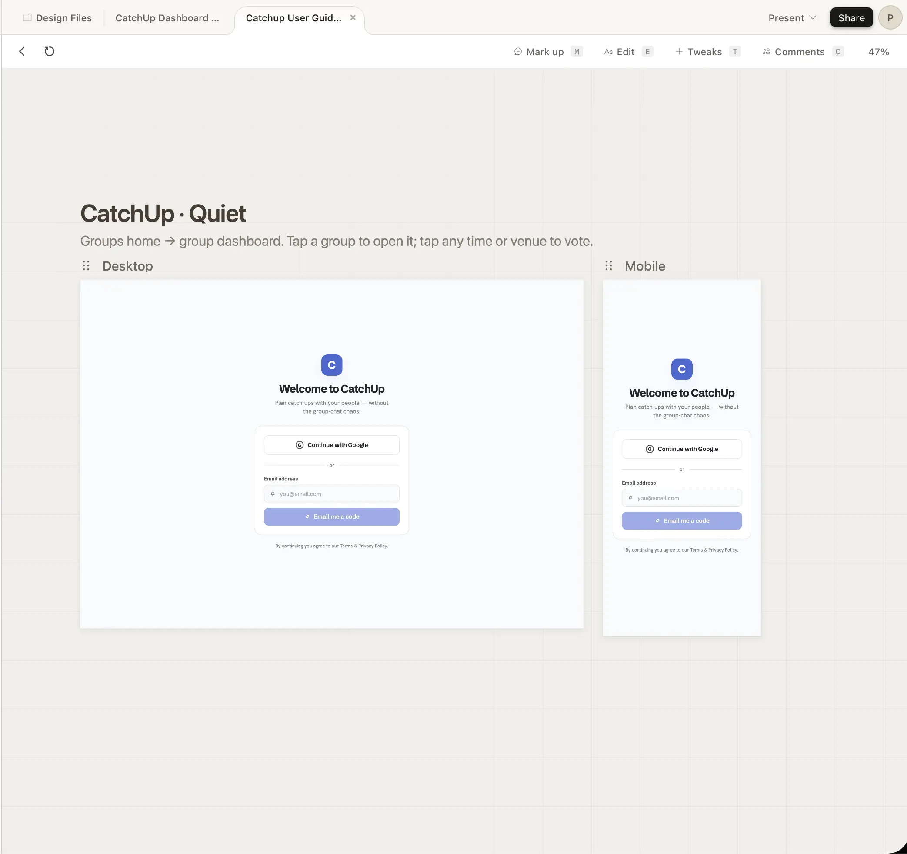
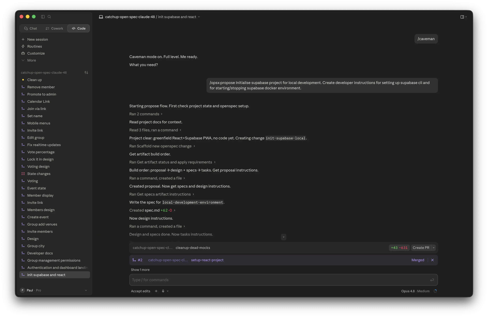
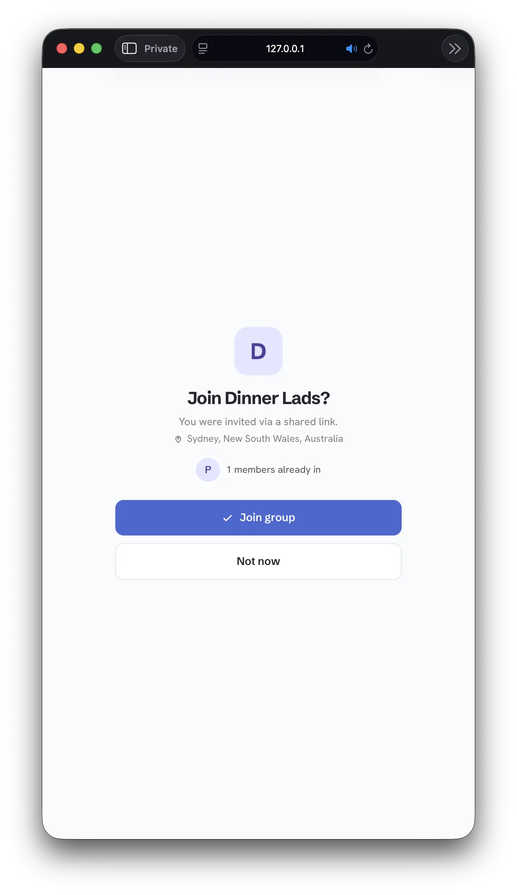
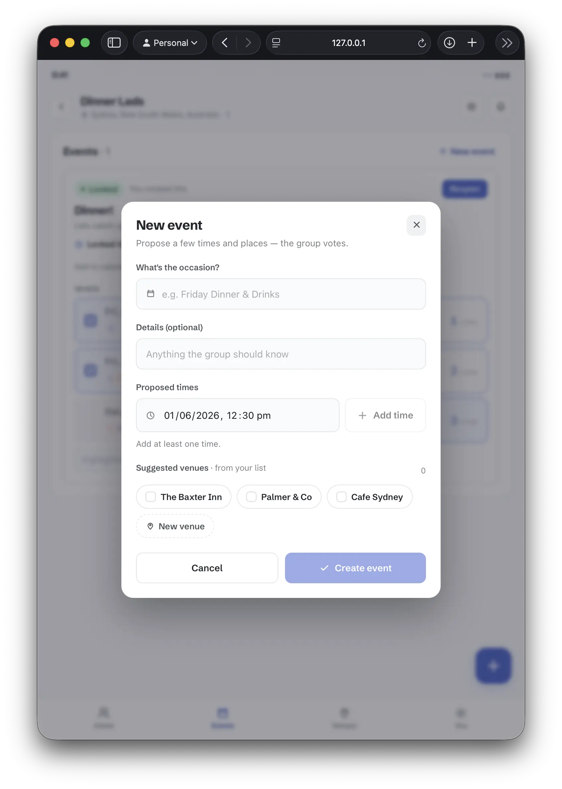
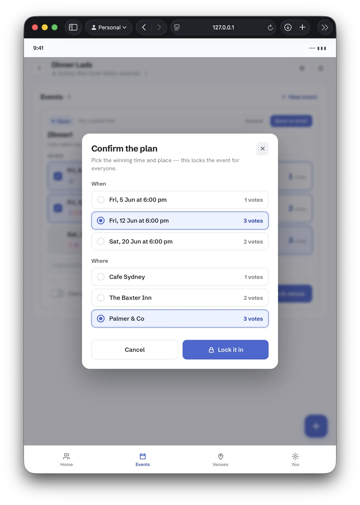
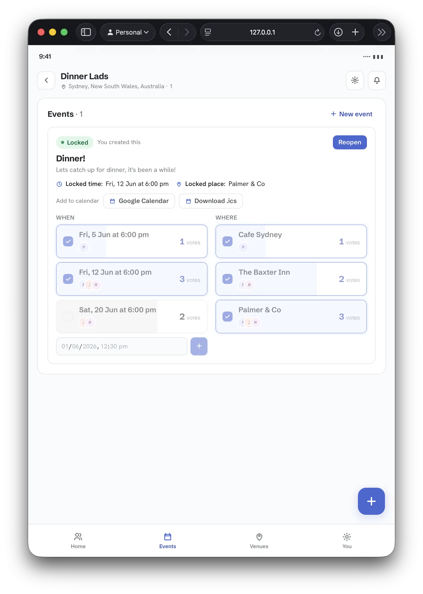

AI-assisted engineering has transitioned from chat-based prompts to multi-agent coordinate workflows. By pairing specialized tools—**Claude Code** for terminal-driven implementation and **Claude Design** for interactive visual prototyping—with **OpenSpec** to maintain a structured development loop, developers can build fully-featured production apps in days.

This article walks through how I built **CatchUp**—a React + Supabase Progressive Web App (PWA) designed to let friends coordinate events, vote on dates/locations, and lock in bookings without group chat chaos.


**Key Takeaway**: High-quality AI development requires strict context management. Combining standard specifications (OpenSpec), low-verbosity communication (Caveman mode), and visual-to-code transitions yields stable, rapid builds.


---

## Technical Stack & Initial Setup

The application is structured to support offline-first capabilities and mobile installations:

*   **Frontend**: React (configured as a PWA)
*   **Database & Auth**: Supabase (running locally for development)
*   **Agents**: Claude desktop app with Opus 4.8 Medium, Claude Code CLI
*   **Context Control**: OpenSpec + "Caveman" low-verbosity settings to optimize token consumption

### Setup Steps
```bash
# Initialize git repository
git init

# Node configuration (using active LTS)
echo "24.15" > .nvmrc

# Install and initialize OpenSpec
npm install -g openspec
openspec init

# Install local database stack
brew install supabase/tap/supabase
supabase init
```

I populated the `ReadMe.md` and `openspec/config.yaml` to ensure the Claude agents had immediate, grounded references for the product's boundaries before writing a single line of logic.


Once I had Supabase installed and running in Docker, I configured the `.env` with the anon key - and from there Claude took care of everything - applying migrations, resetting the database when needed etc.


---

## Visual Prototyping: Claude Design

Initial UI instructions produced functional but brutalist interfaces. To fix this, I offloaded visual layouts to **Claude Design**:

1.  Pasted raw product requirements from `ReadMe.md` into Claude Design.
2.  Iterated interactive UI states (joining groups, creating events, voting).
3.  Exported the completed visual asset zip.
4.  Instructed Claude Code to extract the zip and systematically implement the design system.

When new components or states were needed, I reverted to Claude Design, revised the layout, exported a new bundle, and prompted Claude Code to update the implementation.



---

## Implementation Loop: Propose, Apply, Archive

Rather than feeding raw instructions directly to Claude Code, all features were mediated via the OpenSpec `/opsx` interface. This pipeline ensures changes remain trackable and context stays clean.


graph TD
    A[Start Session + Caveman Mode] --> B["opsx:propose 'feature'"]
    B --> C[Evaluate Spec, Tasks & Schema]
    C --> D[opsx:apply Implementation]
    D --> E[Automatic Preview & Manual Test]
    E --> F[opsx:archive Specification]
    F --> H[Raise Pull Request]
    H --> I[Merge to Main]
    I --> G["Next Feature Loop / End Session"]


### The Feature Loop Steps:

#### 1. Session Setup
To prevent unnecessary context bloat, every new feature implementation started with a fresh shell session. I invoked **Caveman Mode** to force the agent to use short, action-focused responses. This significantly reduced token usage across the five-hour quota windows.

#### 2. Propose
```bash
/opsx:propose "Group members can vote on proposed dates and venues"
```
This command compiles the feature request and checks existing specifications. It generates:
*   A localized feature proposal.
*   Schema changes (migration scripts for Supabase).
*   Interactive frontend tasks and verification specs.

#### 3. Apply
```bash
/opsx:apply
```
Once the proposal passed sanity checks, `/opsx:apply` kicked off file writing. The agent executed backend schema updates, built components, and initiated local servers, checking functionality dynamically using its local preview pane.



#### 4. Archive
```bash
/opsx:archive
```
After verifying the changes in my local browser, archiving the feature updated the master specifications directory. This ensured future Claude sessions could build upon accurate, current context without carrying deprecated drafts.

After archiving I'd instruct Claude to "raise PR" and subsequently "merge".

---

## The CatchUp PWA User Experience

The finalized application integrates real-time Supabase states, offline storage, and responsive views suitable for standalone mobile installation.

### Joining a Group
Users enter a shared group URL to link their accounts and join active planning instances.



### Proposing Events
Group organizers propose multiple dates and venue slots to eliminate single-option planning friction.



### Multi-Slot Voting
Members review dates and locations simultaneously, using quick toggles to vote on options that fit their schedules.


### Confirmation & Locked-In States
Once planning concludes, the host locks in the final selection, updating the group dashboard into a single active schedule card.




---

## Lessons Learned & Optimization Tips

Building with advanced agent systems requires structural discipline. Keep these principles in mind:

*   **Decouple Design and Logic**: Let Claude Design handle the aesthetics and layout exports, and let Claude Code focus on state machine wiring, integrations, and database operations.
*   **Enforce Strict Verbosity Rules**: Caveman mode or system-level directives to avoid chatty AI behaviors saves token consumption over prolonged sessions.
*   **Maintain Versioned Specifications**: Keeping specifications up to date and accurately reflecting the goal means a focussed context.


I plan on using AntiGravity to do a code review and see if anything can be improved. 


## Current openspec directory content

For anyone interested, my `openspec` directory looks like the following:

```text
openspec/
├── changes
│   └── archive
│       ├── 2026-05-29-add-authentication
│       ├── 2026-05-29-add-dev-docs
│       ├── 2026-05-29-add-group-city-field
│       ├── 2026-05-29-add-group-invite-links
│       ├── 2026-05-29-create-event
│       ├── 2026-05-29-group-add-venues
│       ├── 2026-05-29-init-supabase-local
│       ├── 2026-05-29-manage-groups
│       ├── 2026-05-29-setup-react-project
│       ├── 2026-05-30-add-event-voting
│       ├── 2026-05-30-allow-status-rollback
│       ├── 2026-05-30-change-event-status
│       ├── 2026-05-30-fix-group-roster
│       ├── 2026-05-30-fix-realtime-event-sync
│       ├── 2026-05-30-fix-venue-search-input-visibility
│       ├── 2026-05-30-group-invite-links
│       ├── 2026-05-30-integrate-members-list
│       ├── 2026-05-30-move-lock-trigger-to-footer
│       ├── 2026-05-30-optout-toggle-switch
│       ├── 2026-05-30-personalize-member-identity
│       ├── 2026-05-30-redesign-lock-in-dialog
│       ├── 2026-05-30-simplify-voting-to-tickbox
│       ├── 2026-05-30-vote-bg-percentage
│       ├── 2026-05-31-add-user-display-name
│       ├── 2026-05-31-edit-groups
│       ├── 2026-05-31-fix-mobile-menus
│       ├── 2026-05-31-join-via-link-flow
│       ├── 2026-05-31-locked-event-calendar-link
│       ├── 2026-05-31-restrict-invite-link-to-admins
│       ├── 2026-05-31-wire-up-admin-promote-members
│       └── 2026-06-01-wire-up-remove-member
├── config.yaml
└── specs
    ├── authentication
    │   └── spec.md
    ├── dashboard
    │   └── spec.md
    ├── developer-getting-started
    │   └── spec.md
    ├── display-name-editing
    │   └── spec.md
    ├── event-calendar-export
    │   └── spec.md
    ├── event-voting
    │   └── spec.md
    ├── events
    │   └── spec.md
    ├── frontend-app-scaffold
    │   └── spec.md
    ├── group-invites
    │   └── spec.md
    ├── group-venues
    │   └── spec.md
    ├── groups
    │   └── spec.md
    ├── local-development-environment
    │   └── spec.md
    ├── location-autocomplete
    │   └── spec.md
    ├── member-identity
    │   └── spec.md
    ├── mobile-navigation
    │   └── spec.md
    └── user-profiles
        └── spec.md
```

An example archive directory:

```text
openspec/changes/archive/2026-05-29-add-authentication
├── design.md
├── proposal.md
├── specs
│   ├── authentication
│   │   └── spec.md
│   ├── dashboard
│   │   └── spec.md
│   └── user-profiles
│       └── spec.md
└── tasks.md
```
