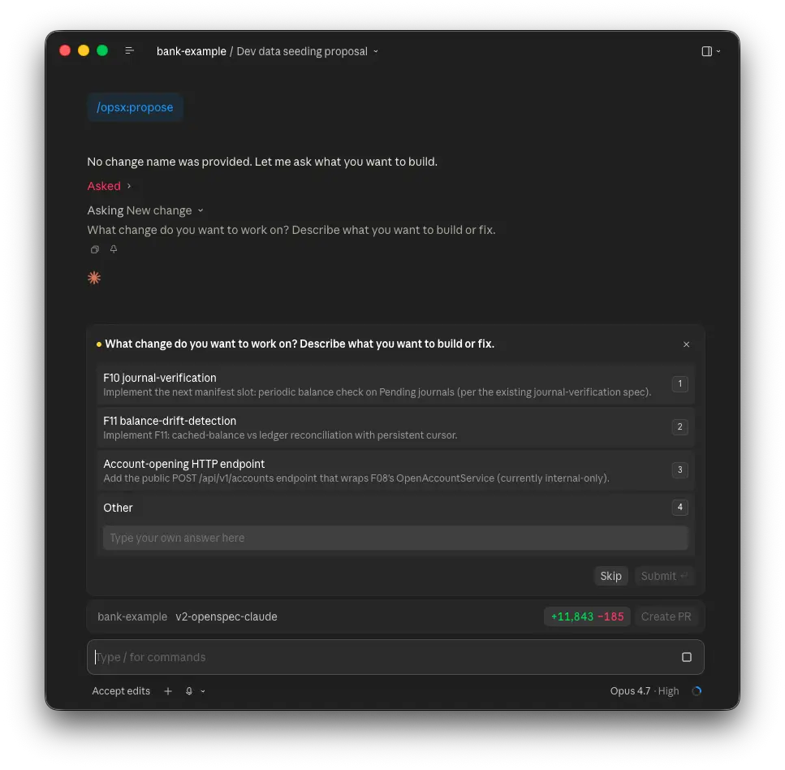
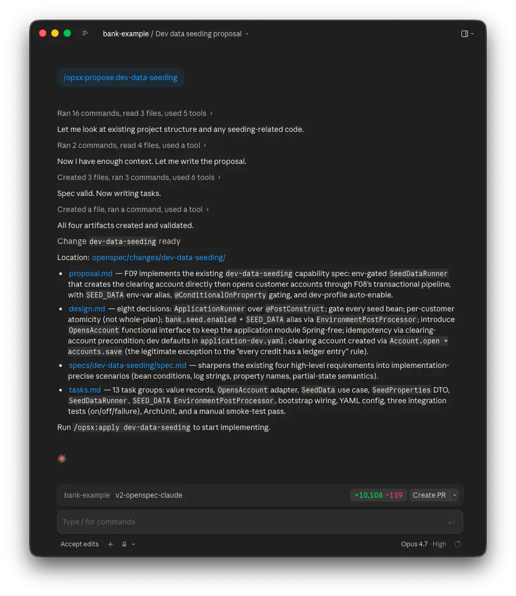
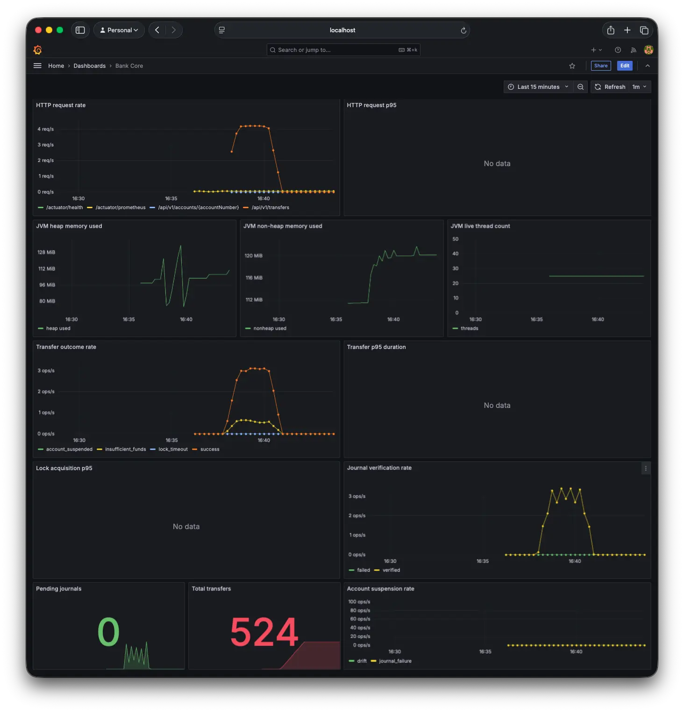
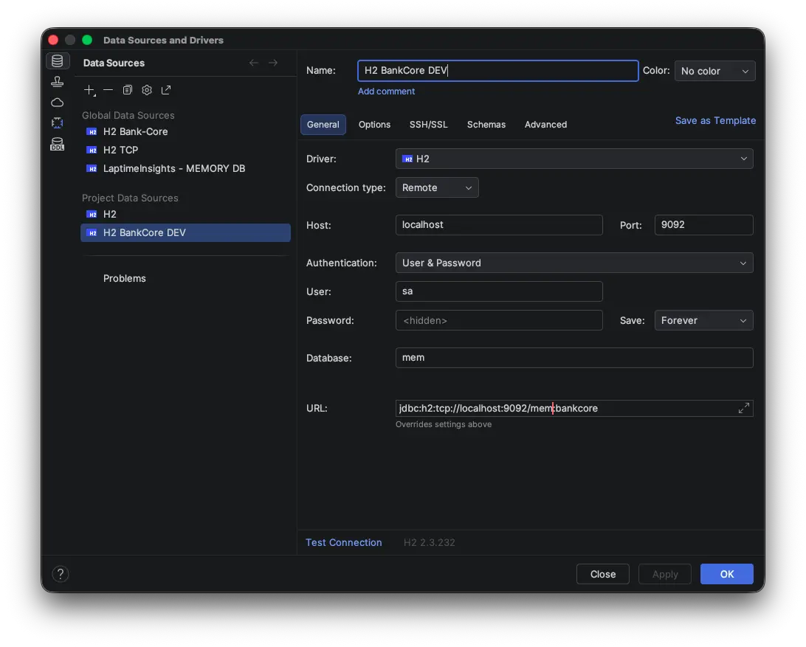


 https://github.com/prule/bank-example/tree/v2-openspec-claude



 [Evaluating bank-core v1-basic](  )


## Introduction

Following on from the `v1-basic` version of my bank-example, I decided to take the generated code and use it as a basis for a new version, `v2-claude`. This time, I wanted to see how well I could use AI, specifically Anthropic's Claude, to help me build out a more complete application, using a specification-driven approach with OpenSpec. This blog post documents my journey, the successes, the bumps in the road, and my overall impressions.

## The Setup: Getting Started with OpenSpec

The first step was to get my project set up with OpenSpec. This involved a few key steps:

1.  **Creating a new branch** in my git repository to keep this work separate from the `v1-basic` code.
2.  **Installing OpenSpec** globally using npm: `npm install -g @fission-ai/openspec@latest`.
3.  **Initializing OpenSpec** in the project: `openspec init`.
4.  **Generating Specs**: I had previously used Claude to generate a set of specifications and documentation from the `v1-basic` codebase. I copied these into the `specs` folder.
5.  **Environment Setup**: I had to make sure I had Java 25 available, which I managed using SDKMAN. This also meant updating my IntelliJ project and some documentation to use Java 25.

A small hiccup I encountered was that the initial specs weren't in the OpenSpec format. A lesson learned here: I should have instructed Claude to generate the specs in the correct format from the start. I ended up asking Claude to convert them later.

## The Workflow: `propose/apply/archive`

With the setup complete, I started using the core OpenSpec workflow: `propose`, `apply`, and `archive`. I worked through a series of features, starting with `F00-project-setup`.

I hit a snag with Gradle, as my installed version (8.12) had issues with Java 25. It would have been smoother if I'd upgraded Gradle beforehand. Another learning point was to be less specific about library versions in my requirements, instead asking for the "latest" versions to avoid conflicts.

I then moved through a series of features, applying the same pattern:

*   `contract-first-api`
*   `api-error-contract`
*   `account-domain`
*   `immutable-ledger`

One interesting observation was during the `transfer-locking` feature. The initial implementation of locking was done without a database table, as the database wasn't set up at that point. This suggests that perhaps the feature breakdown could have been ordered differently to get the database in place earlier.

## Adding Observability and Load Testing

Once the core features were in place, I wanted to add observability to the application. A simple prompt to Claude:

```
/opsx:propose add observability to the application using prometheus and graphana.
```

This resulted in new specs for an `observability-stack` and `metrics-exposure`. To actually see some data, I also asked for a `load-generator`. 

```text
/opsx:propose we need a way to generate some load so we can see the dashboard working
```

This entire process was remarkably smooth, and I soon had metrics flowing into a Grafana dashboard, all with minimal effort.

## Iterating on Design: The Case of HATEOAS

A great example of the iterative power of this approach came when implementing HATEOAS. The first design Claude produced didn't use the Spring HATEOAS framework. I was able to course-correct by proposing a new spec that explicitly required the use of the Spring framework. 

```text
/opsx:propose Spring HATEOAS  provides a much cleaner, standardized way to handle hateoas links using RepresentationModel and RepresentationModelAssembler.

Why this is better:
Separation of Concerns: Your controller only handles HTTP orchestration. The assembler handles transformation and link generation.
Standardized JSON: Spring HATEOAS will format the links using the standard _links HAL format automatically, making your API predictable for clients.
Reusability: If you need to return an AccountResponse from a different endpoint (like listing all accounts), you just inject the assembler and call assembler.toCollectionModel(accounts)
```

This worked perfectly, and the improved design is now captured in the `hateoas-discovery` spec.

This demonstrates the ability to shape the application's design after the initial implementation and have those changes baked back into the main specification for future reference.

## Final Thoughts and Next Steps

After completing the main set of features, I asked Claude for suggestions on what could be done next. It produced a `Todo.md` file with a good list of potential improvements. I went ahead and got it to implement `transfer-idempotency` from that list.

Overall, I'm very impressed with the results. The generated code is well-organized, following a clean architecture pattern which is enforced with ArchUnit tests. The use of contract-first API design with OpenAPI, and the inclusion of HATEOAS with Spring, has resulted in a robust and modern API.

One implementation detail I'm still pondering is the `DbAccountLocker`. It's an interesting approach, but I'm not yet sure if it's the one I would have chosen.

This experiment has been a resounding success. Using Claude and OpenSpec, I was able to rapidly develop a well-architected application, iterate on its design, and build out a comprehensive feature set, all while maintaining a clear and executable specification.
 
If it's not perfect, I expect corrections to the specs could easily be made to adjust accordingly.

See the specs and history of what got build in the `openspec` directory of the github repository https://github.com/prule/bank-example/tree/v2-openspec-claude/openspec.

> The propose/apply/archive approach works well, resulting in a collection of specs that represent the current status in sync with the code. It seems feasible to approach implementation in an incremental or phased approach - doing as little or as much upfront as you wish.

> I suspect the usual rules will apply - trying to break the problem up into small pieces which can be independently worked on - keeping the context as small as possible. Good for teams, good for cognitive load. 

---

Screenshots:









---


Here's the output of a propose/apply/archive process:


```text
/opsx:propose
```

What change do you want to work on? Describe what you want to build or fix.

```text
fund-transfer (F06) (Recommended)
```

All four artifacts created for change `fund-transfer` at `openspec/changes/fund-transfer/`:

- **`proposal.md`** — F06 composes F01 (Account mutators + exceptions), F02 (ledger/journal port), F05 (Accounts port + 404 mapping), and F07 (paired-lock primitive) into the service's first HTTP write endpoint. Closes the `self-transfer` open decision by rejecting same-account transfers as `400 BAD_REQUEST_PAYLOAD` via a new `SameAccountTransferException`. Adds four `@ExceptionHandler` entries for the F01 domain exceptions.
- **`design.md`** — Key decisions: `@Transactional` on the controller method (only controller in the codebase with it); **lock-then-load** to prevent stale aggregates; `Money.of(...)` rounds silently to 2 decimals; bean validation handles missing-field + non-positive amount via F03's existing handler; injectable `Clock` for test determinism; one handler entry per exception type (different codes, different messages).
- **`specs/fund-transfer/spec.md`** — 7 `ADDED` requirements: POST endpoint shape (with `operationId: createTransfer`), payload validation (incl. self-transfer rejection), business-rule error mapping (404/ACCOUNT_INACTIVE/INSUFFICIENT_FUNDS), atomicity of all four writes, journal description/status/timestamp, lock-then-load ordering, transactional boundary on the controller, and `SameAccountTransferException` placement.
- **`tasks.md`** — 9 sections (~32 tracked tasks): domain → application use case → OpenAPI → controller → handler → wiring → tests → manifest → verification.

All artifacts complete! Run `/opsx:apply` to start implementing.

```text
/opsx:apply
```

Using change: `fund-transfer`. Override with `/opsx:apply <other>`.

## Implementing: fund-transfer (schema: spec-driven)

I have propose-phase context. Reading the few files I'll need to extend.

Got the patterns. Starting implementation.

## Task 1.1–1.3: domain

## Task 2: application use case

Now the unit tests (2.3, 2.4).

## Task 3: OpenAPI contract additions

`amount` generated as `BigDecimal` with `@DecimalMin("0.01")`, account fields with `@NotNull @Size(min = 1)`. Task 3 done.

## Task 4: controller + mapper

## Task 5: GlobalExceptionHandler extensions

## Task 6: bean wiring

## Task 7: integration tests

Spring Boot 3.4.5 — `@MockitoSpyBean` is supported. Cleaning up unused imports.

Now the controller integration test (7.2).

Task 7.3: extend `OpenApiContractTest`.

## Task 8: close `self-transfer` open decision

## Task 9: verification

Application module has no assertj — using junit + mockito only.

ByteBuddy doesn't support Java 25 yet. Need to set `net.bytebuddy.experimental=true`. Checking the parent build for a place to set this globally.

Now bootstrap.

Bootstrap main scope needs explicit `application` and `domain` deps since `infrastructure` exposes them via `implementation` (not `api`).

All bootstrap tests green. Now clean build + bootRun curl checks.

All checks pass:
- `operationId: createTransfer` ✓
- Empty body → 400 BAD_REQUEST_PAYLOAD with field names ✓
- Nonexistent accounts → 404 RESOURCE_NOT_FOUND (exercises lock-then-load + 404 path end-to-end) ✓

Stop the app + mark tasks complete.

## Implementation Complete

**Change:** fund-transfer
**Schema:** spec-driven
**Progress:** 34/34 tasks complete ✓

### Files created
- `domain/.../SameAccountTransferException.java` + `test`
- `application/.../transfer/` — `TransferCommand`, `TransferFunds`
- `application/.../transfer/test/` — `TransferCommandTest`, `TransferFundsTest`
- `infrastructure/.../web/transfer/` — `TransferController`, `TransferRequestMapper`
- `openapi/paths/transfers.yaml` + `openapi/schemas/transfer-request.yaml`
- `TransferAtomicityIntegrationTest` + `TransferControllerTest`

### Files edited
- `openapi.yaml` — registered `/api/v1/transfers` path + `TransferRequest` schema + `transfers` tag
- `GlobalExceptionHandler.java` — 4 new `@ExceptionHandler` entries + Javadoc update
- `BankCoreApplication.java` — `@Bean Clock systemClock()` + `@Bean TransferFunds`
- `bootstrap/build.gradle.kts` — added `implementation(project(":application"))` + `implementation(project(":domain"))` so `BankCoreApplication` can reference them in `@Bean` factories
- `build.gradle.kts` — `systemProperty("net.bytebuddy.experimental", "true")` for Mockito on Java 25
- `OpenApiContractTest.java` — 2 new assertions for `createTransfer` + `TransferRequest`
- `openspec/config.yaml` — `self-transfer` open decision closed

### Verification
- `:domain:test`, `:application:test`, `:bootstrap:test` all green
- `./gradlew clean build` green (25 tasks)
- bootRun live checks: `operationId=createTransfer`; empty body → 400 BAD_REQUEST_PAYLOAD with field-naming message; nonexistent accounts → 404 RESOURCE_NOT_FOUND end-to-end via lock-then-load

All tasks complete! You can archive this change with `/opsx:archive`.


```text
/opsx:archive
```

All done. Delta spec exists at `openspec/changes/fund-transfer/specs/fund-transfer/spec.md`. The main spec at `openspec/specs/fund-transfer/spec.md` has the original 5 requirements; the delta refines them with more detail and adds 3 new ones (lock-then-load ordering, controller-level transactional boundary, `SameAccountTransferException` placement).

Sync the delta spec into openspec/specs/fund-transfer/spec.md before archiving?

```text
Sync now
```

## Archive Complete

**Change:** fund-transfer
**Schema:** spec-driven
**Archived to:** `openspec/changes/archive/2026-05-24-fund-transfer/`
**Specs:** ✓ Synced to `openspec/specs/fund-transfer/spec.md` — 8 requirements (5 refined from the prior baseline + 3 new: lock-then-load ordering inside the use case, controller-level transactional boundary, `SameAccountTransferException` placement). Purpose paragraph extended to call out the composition over F02/F05/F07.

All artifacts complete. All 34 tasks complete.

```text
commit
```

Four uncommitted phases stacked together. I'll split into 2 commits — first the account-lookup archive, then everything F06 (propose+apply+archive squashed since no intermediate commits were made).

Now everything F06 in one commit (propose+apply+archive squashed — no intermediate commits were made between phases).

Two commits:
- `0e2a218 opsx:archive account-lookup` (renames + spec sync)
- `22497f2 opsx:apply fund-transfer (propose+apply+archive squashed)` (25 files, +1712/−41) — code, build, openspec docs in archive, and spec sync. Squashed because no intermediate commits were taken between F06's propose, apply, and archive phases.

Working tree clean.
