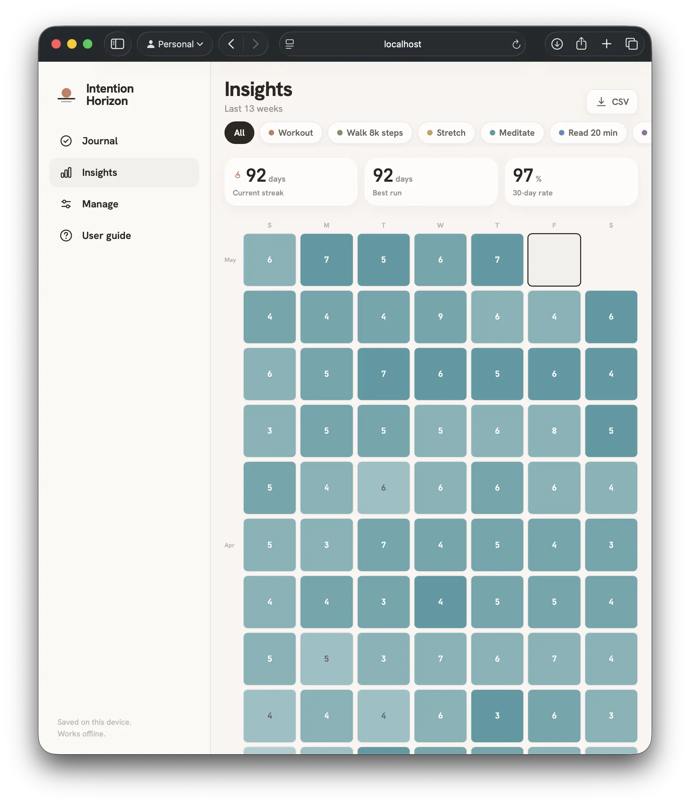
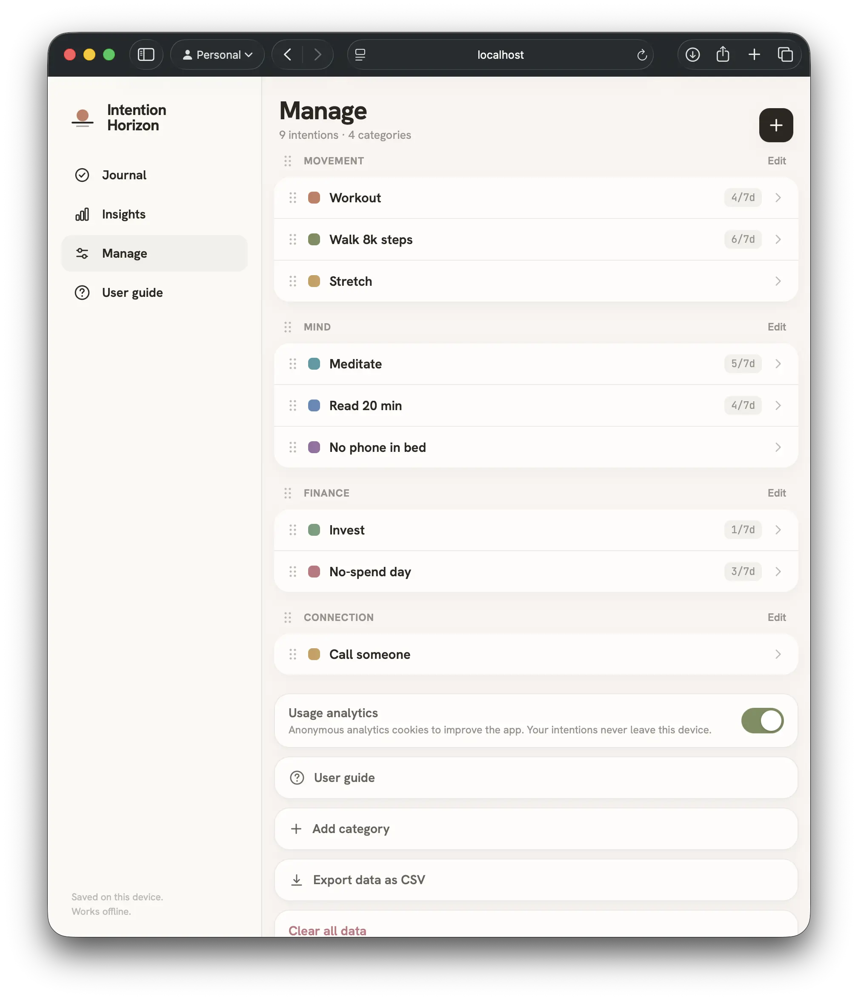
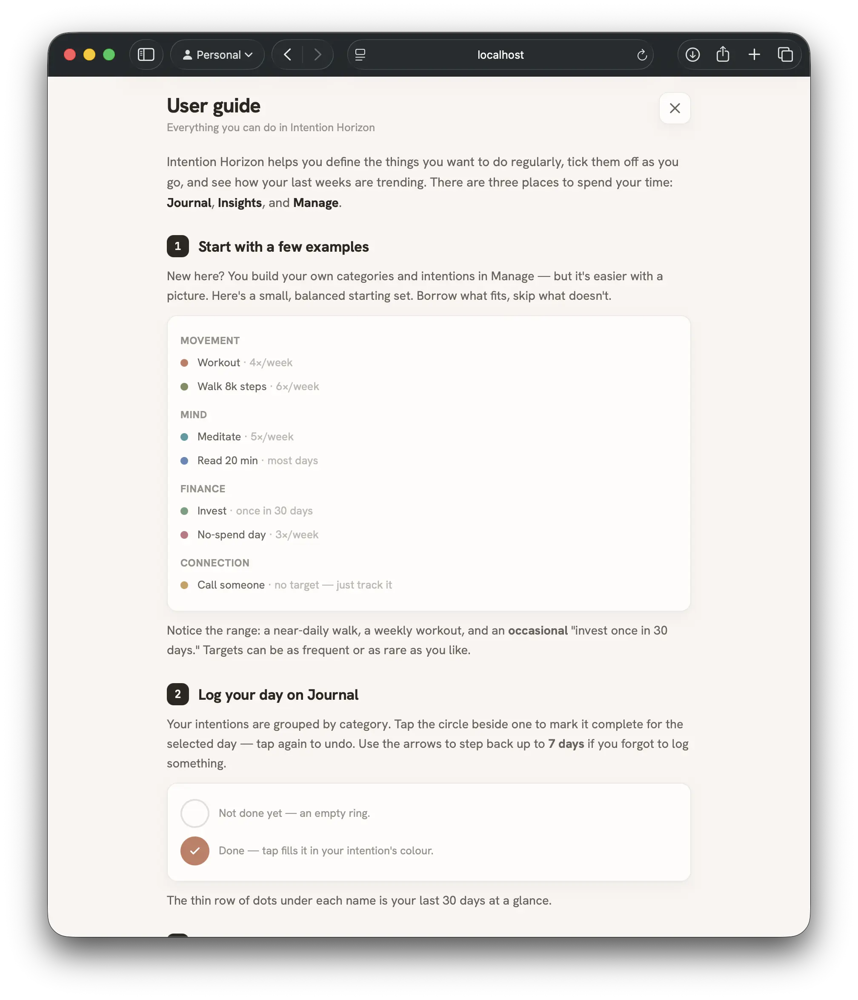


https://github.com/prule/intentionhorizon


I built **[Intention Horizon](http://intention.vamonossoftware.com/)** as a sample app — something concrete to point at when discussing how to build software with AI. It's a local-first habit tracker: define intentions, group them by category, tick them off each day, and watch your count move against a target you set — N completions over M days. React PWA, IndexedDB via Dexie, no backend. That made it a good test bed: small enough to finish, real enough to have edge cases.

## The design handoff is where tools win or lose

I started in [Stitch](https://stitch.withgoogle.com). It produced a reasonable UI. The problem came at handoff — pushing it into Antigravity didn't give me a good result. That may be on me; there's probably a better way to drive that path. But I wasn't going to fight tooling for a sample app.

Claude Design and Claude Code, by contrast, were a breeze. Nice UI, and it converted to working code with almost no friction. The flow:

1. Build the UI in [Claude Design](https://claude.ai/design).
2. Export it via the **handoff** feature — download the zip.
3. Drop the zip into the [Claude Code](https://claude.ai/code/) project.
4. Paste the recommended conversion prompt.

That produced JSX. I then asked Claude Code to convert it to TypeScript, which became its own tracked change. The lesson isn't "Claude good, other tool bad" — it's that **the export-and-handoff seam is the thing that matters**. A design that exports as a clean artifact you can hand an agent beats a prettier design that doesn't.


Generate JSX first, get it rendering, *then* migrate to TypeScript as a separate step. Converting a working component to types is a mechanical, reviewable change. Asking for typed code cold mixes two kinds of error — layout and types — into one diff.


## OpenSpec for evolving requirements

Once the UI was real code, requirements started moving — which is the normal state of any project. I drove those changes through [OpenSpec](https://github.com/Fission-AI/OpenSpec): each change is a spec proposed, implemented, then archived. The archive tells the story:

```
migrate-to-typescript
add-url-routing
flexible-completion-target
add-data-source-toggle
default-real-gate-mock
insights-sort-recent-first
add-e2e-playwright-screenplay
refactor-e2e-serenity-screenplay
add-serenity-reports
...
```

Each is a discrete, reviewable unit of intent rather than a vague chat instruction. The win is that an AI agent works far better against a written spec than against "make it do X" — the spec is the shared contract, and the diff can be checked against it.

## End-to-end tests: Screenplay over Page Objects

The e2e layer uses [Playwright](https://playwright.dev) driven through [Serenity/JS](https://serenity-js.org), structured with the **Screenplay pattern**. The spec reads as a script of a person performing a flow:

```ts

describe('Logging a completion', () => {
  it('marks the intention done and bumps its 7-day count', async ({ actor }) => {
    await actor.attemptsTo(
      Ensure.that(CompletionState.of('Read'), isFalse()),
      Ensure.that(WindowCount.forTarget('Read'), equals(3)),

      LogIntention.named('Read'),

      Ensure.that(CompletionState.of('Read'), isTrue()),
      Ensure.that(WindowCount.forTarget('Read'), equals(4)),
    );
  });
});
```

### Why Screenplay

Page Object tests answer *"what's on the page."* Screenplay tests answer *"what is the user doing."*

- **Reads as a user journey.** An actor — named Tess — `attemptsTo` a sequence of Tasks. The test is living documentation, not a pile of selector calls.
- **One responsibility per layer.** Locators live in `elements.ts`, user actions in `tasks.ts`, state reads in `questions.ts`. Specs compose Tasks and Questions and never touch a selector.
- **A change is a one-line edit.** When a `data-testid` moves, you edit one locator. When a flow changes, you edit one Task. The blast radius is small.
- **Failures point at the user step.** A break surfaces as "the user couldn't log 'Read'," not as a null selector buried three helpers deep.

The cost is one extra layer — you write Tasks and Questions instead of calling the page directly. The payoff is that selectors, interactions, and assertions each live in exactly one place and compose. For an AI-assisted codebase that's a strong fit: the agent extends the suite by adding a Task or a Question against clear boundaries, instead of hand-threading selectors through every spec.


Strict boundaries: **specs don't touch locators, Tasks don't assert, Questions don't act.** Tasks end on an observable settle (`Wait.until(form, not(isVisible()))`), never a fixed sleep. That discipline is what keeps the suite stable and the edits one-line.


### Why Serenity/JS

Serenity gives more than a Screenplay API:

- **Narrative reporting.** Every Task carries a human description (`#actor logs "Read"`), so the console and BDD reports read as plain-English steps — useful to non-engineers and as a record of what's actually covered.
- **Rich Playwright integration.** The `BrowseTheWebWithPlaywright` ability wraps Playwright, so you keep its speed and reliability while gaining Screenplay structure on top.
- **Composable interactions and assertions.** `Click`, `Enter`, `Wait`, `Ensure`, `Attribute`, `Text` compose into Tasks and Questions with consistent semantics.
- **Living documentation as an artifact.** `serenity-bdd run` generates a report from the run — `npm run e2e:report` does exactly this — turning the test suite into browsable evidence of behavior.

Determinism comes from a seed injected onto `window` before the app boots, gated behind a DEV flag so production never sees it. Each test gets a fresh browser context and a known dataset, so date-window math is correct on any run date.

An example e2e test which is extremely readable:

```typescript
import { describe, it } from '../fixtures';
import { Ensure, contain, not } from '@serenity-js/assertions';
import { GoToTab, AddIntention, EditIntention, DeleteIntention } from '../tasks';
import { IntentionList } from '../questions';

describe('Managing intentions', () => {
  it('creates, renames, and deletes an intention', async ({ actor }) => {
    // create on Manage, see it on Today
    await actor.attemptsTo(
      GoToTab.to('settings'),
      AddIntention.named('Floss'),
      GoToTab.to('entry'),
      Ensure.that(IntentionList.names(), contain('Floss')),
    );

    // rename on Manage, see the new name on Today
    await actor.attemptsTo(
      GoToTab.to('settings'),
      EditIntention.rename('Floss').to('Floss nightly'),
      GoToTab.to('entry'),
      Ensure.that(IntentionList.names(), contain('Floss nightly')),
      Ensure.that(IntentionList.names(), not(contain('Floss'))),
    );

    // delete on Manage, gone from Today
    await actor.attemptsTo(
      GoToTab.to('settings'),
      DeleteIntention.named('Floss nightly'),
      GoToTab.to('entry'),
      Ensure.that(IntentionList.names(), not(contain('Floss nightly'))),
    );
  });
});
```

The e2e suite can be easily run with `npm run e2e`:

```text
✓ Execution successful (4s 918ms)
================================================================================
Execution Summary

Analytics correctness:     1 successful, 1 total (1s 957ms)
Date navigation:           4 successful, 4 total (4s 578ms)
Insights tab:              1 successful, 1 total (783ms)
Intention targets:         2 successful, 2 total (4s 605ms)
Logging a completion:      2 successful, 2 total (2s 652ms)
Managing categories:       2 successful, 2 total (6s 842ms)
Managing intentions:       1 successful, 1 total (4s 918ms)
Persistence across reload: 2 successful, 2 total (3s 437ms)

Total time: 29s 772ms
Real time: 9s 637ms
Scenarios:  15
================================================================================

  15 passed (10.2s)
```

For the full output see https://github.com/prule/intentionhorizon/blob/main/sample-e2e-run.txt

## How the app works, and what you get from it


**Define intentions → tick them off daily → watch your horizon.**


- **Daily entry.** Intentions grouped by category (Exercise, Finance, Focus). Toggle completion for today, and scroll back through a trailing window to fill in or review prior days. Each row shows a single live stat: completions in the trailing target period versus the target.
- **Flexible targets with status.** Set one optional target per intention — *N completions over M days* (e.g. `3× per 7 days`), which covers everything from "once a year" to "twice a fortnight" with one concept. The current count renders under / on / over target, so a glance tells you where you stand — no mental arithmetic.
- **Analytics.** A 7-column consistency grid (one per weekday) shades by how many intentions hit target, plus month-over-month trends and streak insights.
- **Local-first and portable.** Everything is stored in IndexedDB on your device — private by default, no account — and exportable to CSV whenever you want your data out.

The user benefit is the design intent: **low-friction, high-density, honest feedback.** It's built for people who want data-driven self-improvement without gamification or decoration — define what matters, record it in seconds, and see consistency at a glance.

## What carried the project

- A design tool that **exports a clean handoff artifact** an agent can consume — that seam decided the whole project.
- **JSX first, TypeScript second** — sequence the migration so each diff has one kind of error.
- **OpenSpec** to turn moving requirements into discrete, reviewable changes an agent can implement against a contract.
- **Screenplay + Serenity/JS** to get e2e tests that read as user journeys, localize change to one layer, and double as living documentation.

None of these are AI-specific tricks. They're ordinary good practice — clean handoffs, typed code, written specs, layered tests. What AI changes is the cost of *following* them: with the seams in place, Claude Code did the mechanical work, and I spent my time on intent.

## Screen shots







