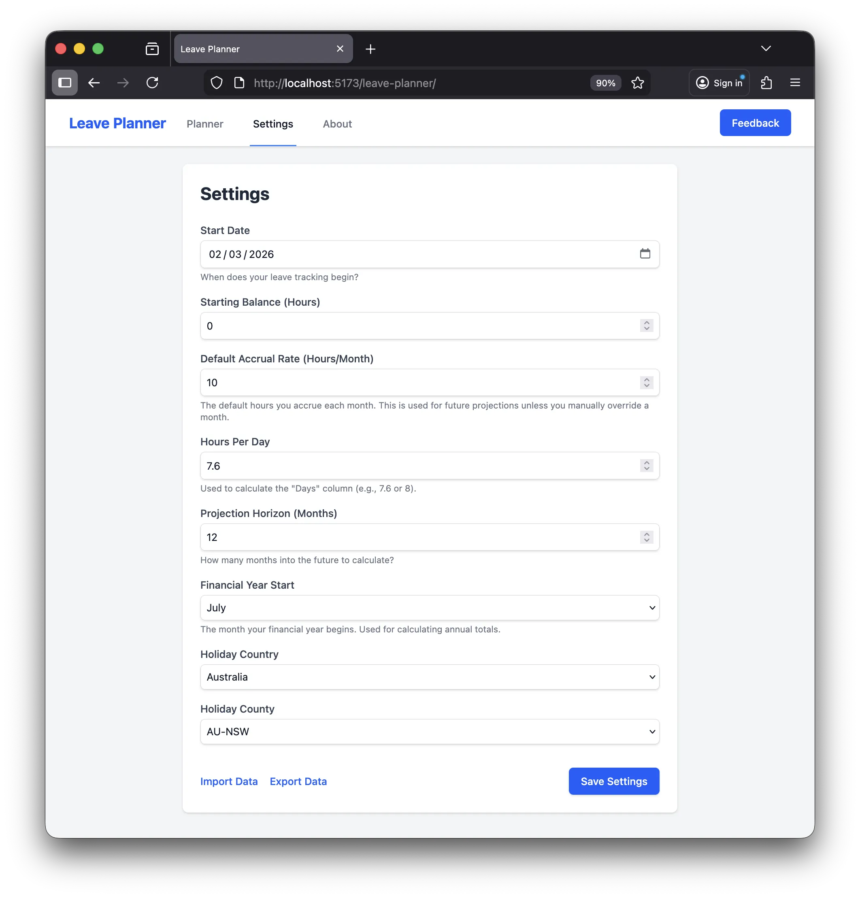
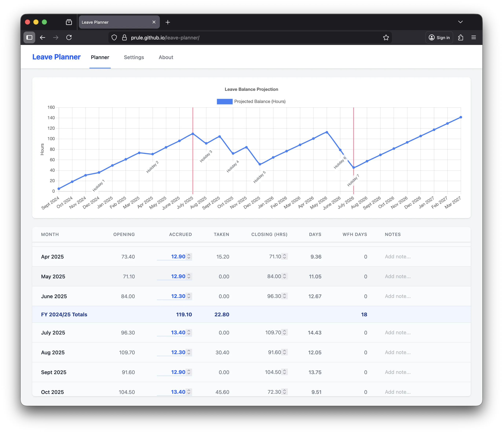
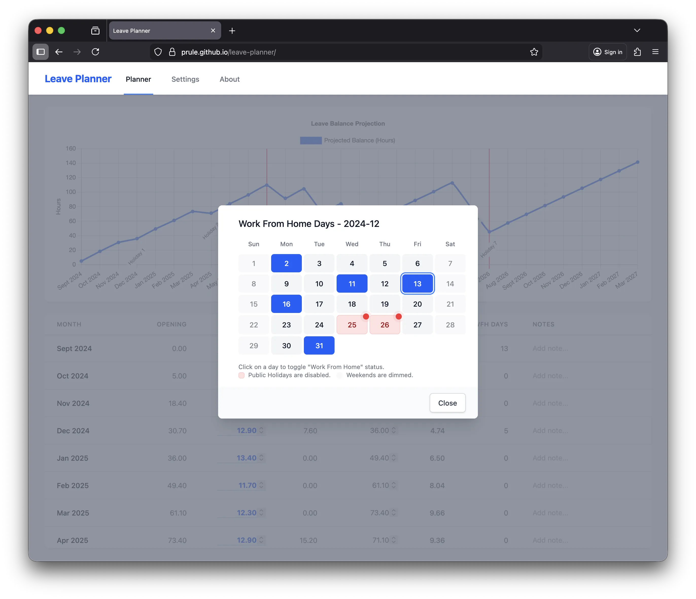

> [Leave Planner](https://prule.github.io/leave-planner/) helps you track your leave balance and plan future holidays with ease.

# Announcing Leave Planner v1.1.0: Work From Home Tracking & More!

This update brings a feature to help you manage your work life better, along with some under-the-hood improvements.

## 🏠 Work From Home (WFH) Tracking

With the rise of hybrid work, keeping track of the days you work from home is more important than ever, especially for tax purposes. Leave Planner now allows you to easily log your WFH days.

### Key Features:
- **Monthly Overview:** See a count of your WFH days directly in the monthly spreadsheet view.
- **Interactive Calendar:** Click on the WFH column to open a calendar where you can toggle days on and off.
- **Public Holiday Integration:** In the Settings page, you can now select your country to automatically fetch public holiday data from Nager.Date. Public holidays are highlighted in red and cannot be selected as WFH days. If your country has regional holidays, a county/state selector will appear, allowing you to see only the holidays relevant to you.
- **Financial Year Summary:** At the end of each financial year (e.g., June), a summary row displays the total number of WFH days, making tax time a breeze.

## 🔄 Automatic PWA Reloading

We've improved the Progressive Web App (PWA) experience. Now, when a new version of Leave Planner is available, the app will automatically reload to ensure you are always using the latest features and fixes. No more stale caches!

## 🛠️ Other Improvements

- **Dependency Upgrades:** We've updated the underlying technologies to keep the app secure and performant.
- **Tailwind 4 Compatibility:** The codebase has been updated to support the latest version of Tailwind CSS.

## Getting Started

If you're already using Leave Planner, simply refresh the page (or let the new auto-reload feature do it for you!) to see the changes. If you're new, head over to the settings to configure your start balance and preferences.

As always, your data is stored locally in your browser for maximum privacy. We recommend exporting your data regularly from the Settings page as a backup.

Happy Planning! 🚀

----

----

----

