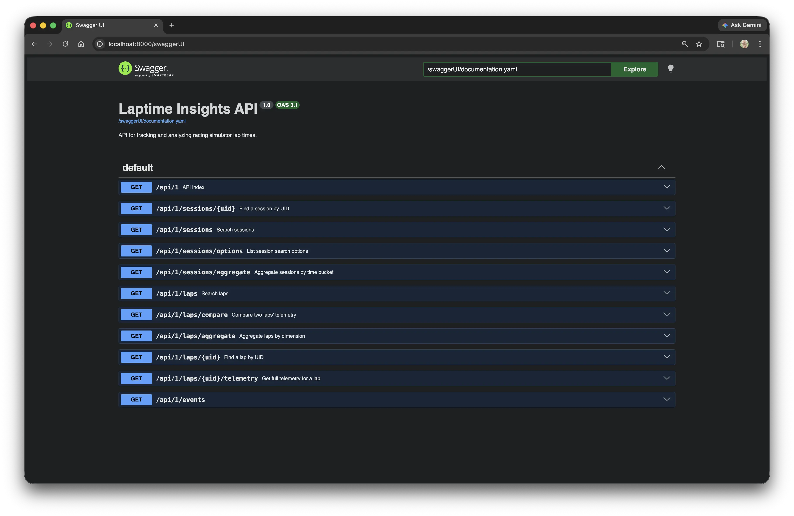
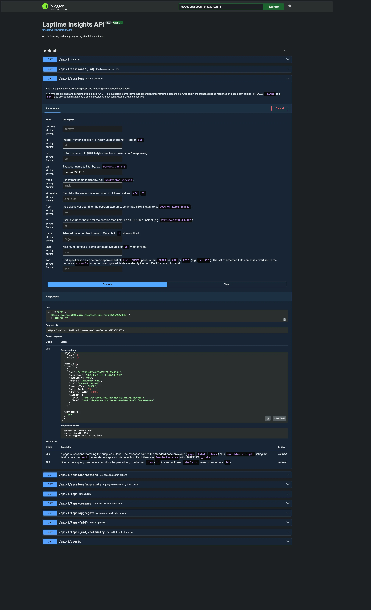

Side projects are a good place to do things properly. Not because the project demands it, but because *you* want the practice.

My ACC dashboard project — [laptime-insights-server](https://github.com/prule/laptime-insights-server) — is a Ktor-based REST API. I added OpenAPI annotations and a Swagger UI. It's not strictly necessary for a personal tool running on localhost. I added it because it's something you'd do on a real project, and because the result is genuinely useful.

## Why bother?

A few reasons.

**It's living documentation.** The API spec is generated from the code. It can't drift out of sync the way a separate wiki page or README can. When a parameter changes, the doc changes.

**It gives you a free interactive client.** Swagger UI lets you execute requests directly from the browser — fill in parameters, hit Execute, inspect the response. No curl commands to remember, no Postman collection to maintain. For a project where you're frequently exploring your own API, this is useful.

**It's what you'd do at work.** That's the real reason. If you want the practice to be meaningful, the standard should match a professional codebase. OpenAPI is now standard. Knowing how to set it up properly is worth having in your hands.

**AI tooling benefits from it.** OpenAPI specs are machine-readable. They're an input for code generators, test harnesses, and increasingly for AI-assisted development workflows. Adding a spec now means those tools are available later.

## The result

Here's what Swagger UI looks like once it's running:



All endpoints documented, with descriptions and response codes. Expand any endpoint and you get the full parameter list. For the session search endpoint, that includes filters for car, track, simulator, date range, pagination and sort:



The response body in the screenshot is real — it came back from a live `Execute` call against the running server. HATEOAS `_links` included.

## How to set it up

### Dependencies

In your Gradle build:

```kotlin
implementation("io.ktor:ktor-server-openapi")
```

That pulls in Ktor's OpenAPI plugin, which handles both the spec generation and the Swagger UI serving.

### Wiring it up in App.kt

Two endpoints to register — one for the Swagger UI, one for the raw OpenAPI document:

```kotlin
routing {
    swaggerUI("/swaggerUI") {
        info = OpenApiInfo(
            title = "Laptime Insights API",
            version = "1.0",
            description = "API for tracking and analyzing racing simulator lap times.",
        )
        source = OpenApiDocSource.Routing(ContentType.Application.Json) {
            routingRoot.descendants()
        }
    }

    openAPI(path = "openapi") {
        info = OpenApiInfo(
            title = "Laptime Insights API",
            version = "1.0",
            description = "API for tracking and analyzing racing simulator lap times.",
        )
        source = OpenApiDocSource.Routing { routingRoot.descendants() }
    }
}
```

`swaggerUI` serves the browser UI at `/swaggerUI`. `openAPI` exposes the raw YAML/JSON spec at `/openapi` — useful if you want to feed it to a code generator or another tool.

The `source = OpenApiDocSource.Routing { routingRoot.descendants() }` part tells Ktor to build the spec by walking your route tree. Any route that has a `describe { }` block attached will appear in the output.

### Documenting a route

The documentation lives next to the route definition. Here's the session search endpoint from `SearchSessionController`:

```kotlin
get<SessionRoutes> {
    call.respond(
        searchSessionUseCase
            .searchSessions(
                SessionSearchCriteria.fromParameters(call.request.queryParameters),
                call.request.toPageRequest(),
                call.request.toSort(),
            )
            .map { SessionResource.fromDomain(it, SessionLinkFactory(application)) }
            .withSortable(Session.SORTABLE_FIELDS)
    )
}
.describe {
    summary = "Search sessions"
    description = """
        Returns a paginated list of racing sessions matching the supplied filter criteria.

        All filters are optional and combined with logical AND — omit a parameter to leave that
        dimension unconstrained. Results are wrapped in the standard paged response and each
        item carries HATEOAS `_links` (e.g. `self`) so clients can navigate to a single session
        without constructing URLs themselves.
    """.trimIndent()

    parameters {
        query("car") {
            description = "Exact car name to filter by, e.g. `Ferrari 296 GT3`."
            required = false
        }
        query("track") {
            description = "Exact track name to filter by, e.g. `Snetterton Circuit`."
            required = false
        }
        query("simulator") {
            description = "Simulator the session was recorded in. Allowed values: `ACC`, `F1`."
            required = false
        }
        query("from") {
            description = "Inclusive lower bound for the session start time, as an ISO-8601 instant (e.g. `2026-04-11T00:00:00Z`)."
            required = false
        }
        query("to") {
            description = "Exclusive upper bound for the session start time, as an ISO-8601 instant (e.g. `2026-04-13T00:00:00Z`)."
            required = false
        }
        query("page") {
            description = "1-based page number to return. Defaults to `1` when omitted."
            required = false
        }
        query("sort") {
            description = "Sort specification as a comma-separated list of `field:ORDER` pairs (e.g. `car:ASC`). Accepted field names are advertised in the response `sortable` array."
            required = false
        }
    }

    responses {
        HttpStatusCode.OK {
            description = "A page of sessions matching the supplied criteria. Each item is a `SessionResource` with HATEOAS `_links`."
        }
        HttpStatusCode.BadRequest {
            description = "One or more query parameters could not be parsed (e.g. malformed `from`/`to` instant, unknown `simulator` value)."
        }
    }
}
```

A few things worth noting here.

The `describe { }` block chains directly off the route handler. It's not a separate annotation or a separate file — it's right there in the controller. That makes it easy to keep in sync. When you change a parameter, you update the `describe` block in the same edit.

The description mentions HATEOAS `_links`. That's intentional — it's part of the API contract. Clients shouldn't be constructing URLs; they should be following links. Surfacing this in the documentation sets the expectation correctly.

The `400` response documents the failure modes explicitly. That's useful for callers and useful for you when you come back to this code in three months.

## What this looks like in practice

With the server running locally, navigate to `http://localhost:8000/swaggerUI`. You get the full endpoint list. Expand any endpoint, fill in parameters, click Execute. The request fires, the response comes back inline. No tooling required beyond a browser.

For the session search, that means you can filter by car name, narrow to a date range, paginate results and sort by field — all from the UI, with the actual live data.

The raw spec is available at `http://localhost:8000/openapi`. Download it and you can import it into Postman, run it through a code generator, or use it as input for AI tooling.

## The discipline it creates

There's a secondary benefit worth mentioning. Adding `describe { }` blocks to every route creates a forcing function. You have to think about what a route actually does, what its failure modes are, and what callers need to know. That thinking improves the API design, not just the documentation.

It's the same reason writing tests is valuable beyond the tests themselves — the act of doing it makes you think more carefully about the thing you're building.

---

*Code is at [github.com/prule/laptime-insights-server](https://github.com/prule/laptime-insights-server).*
