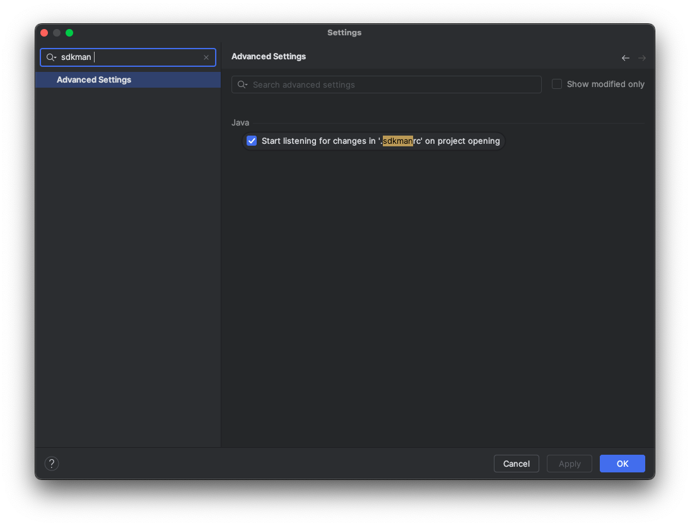

SDKMAN! lets you install, manage and work with multiple versions of software development kits (SDKs) on most Unix-like systems.

This means for example, you can install multiple versions of Java, Kotlin, Scala, Groovy, Gradle, Maven, Grails, Spring Boot, and many more. See the full list as of mid 2024 link:sdk-list.txt[here].

=== Installation

For installation instructions see the SDKMAN! website link:https://sdkman.io/install[here].

=== Usage

For common usage demonstration, using JAVA as an example:

To find all available versions of Java, run:

[source,text]
sdk list java

This will show a list of available versions:

[source,text]
----
================================================================================
Available Java Versions for macOS ARM 64bit
================================================================================
 Vendor        | Use | Version      | Dist    | Status     | Identifier
--------------------------------------------------------------------------------
 Corretto      |     | 22.0.2       | amzn    |            | 22.0.2-amzn
               |     | 21.0.4       | amzn    |            | 21.0.4-amzn
               |     | 17.0.12      | amzn    |            | 17.0.12-amzn
               |     | 11.0.24      | amzn    |            | 11.0.24-amzn
               |     | 8.0.422      | amzn    |            | 8.0.422-amzn
               |     | 8.0.412      | amzn    | local only | 8.0.412-amzn
 Gluon         |     | 22.1.0.1.r17 | gln     |            | 22.1.0.1.r17-gln
               |     | 22.1.0.1.r11 | gln     |            | 22.1.0.1.r11-gln
 GraalVM CE    |     | 22.0.2       | graalce |            | 22.0.2-graalce
               |     | 21.0.2       | graalce |            | 21.0.2-graalce
               |     | 17.0.9       | graalce |            | 17.0.9-graalce
 GraalVM Oracle|     | 24.ea.11     | graal   |            | 24.ea.11-graal
               |     | 24.ea.9      | graal   |            | 24.ea.9-graal
               |     | 24.ea.8      | graal   |            | 24.ea.8-graal

... (the list goes on)
----

See link:sdk-list-java.txt[sdk-list-java.txt] for the full list as of mid 2024.

To install java, choose the identifier (e.g. 22.0.1-open) for the version you want, and run:

[source,text]
----
% sdk install java 22.0.1-open

Downloading: java 22.0.1-open

In progress...

######################################################################################################################################################################################################################################################### 100.0%

Repackaging Java 22.0.1-open...

Done repackaging...
Cleaning up residual files...

Installing: java 22.0.1-open
Done installing!

Do you want java 22.0.1-open to be set as default? (Y/n): n
----

To see what versions of java you have installed, run:
[source,text]
----
% sdk list java | grep -E "installed|local only"

|     | 8.0.412      | amzn    | local only | 8.0.412-amzn
|     | 22.0.1       | open    | installed  | 22.0.1-open
| >>> | 21.0.3       | tem     | local only | 21.0.3-tem
|     | 17.0.7       | tem     | local only | 17.0.7-tem
|     | 11.0.24      | tem     | installed  | 11.0.24-tem
|     | 11.0.19      | tem     | local only | 11.0.19-tem
----

To use a specific version of java, run:

[source,text]
----
% sdk use java 22.0.1-open

Using java version 22.0.1-open in this shell.

----

Confirm with

[source,text]
----
% java -version

openjdk version "22.0.1" 2024-04-16
OpenJDK Runtime Environment (build 22.0.1+8-16)
OpenJDK 64-Bit Server VM (build 22.0.1+8-16, mixed mode, sharing)
----

When you are in the root of your java project, set the appropriate java version using `sdk use java <id>` and then run:

[source,text]
----
% sdk env init

.sdkmanrc created.
----

This creates a `.sdkmanrc` file in the root of your project, which contains the following:

[source,text]
----
include::./.sdkmanrc[]
----

Intellij supports sdkman so your project should be configured to use the correct version of java.

Enable auto switching of java versions as you switch between projects by setting `sdkman_auto_env=true` in `~/.sdkman/etc/config`.

Now as you `cd` into a directory, the correct version of java will be enabled.

[source,text]
----
% cd posts/sdkman

Using java version 21.0.3-tem in this shell.

% cd ../..

Using java version 22.0.1-open in this shell.
----

If you checkout a project, use `sdk env install` to ensure you have the right SDKs installed and activated.

[source,text]
----
% sdk env install

java 21.0.3-tem is already installed.

Using java version 21.0.3-tem in this shell.
----

See the full documentation at https://sdkman.io/usage/

=== Summary

When starting a new project, install specific versions of the tools you need using SDKMAN!.

Make sure to commit an `.sdkmanrc` file to the root of your project so that your team members can use the same versions of the tools you are using. They can easily install the correct versions using `sdk env install`.

This will ensure that you have a consistent development environment, regardless of the machine you are working on.
