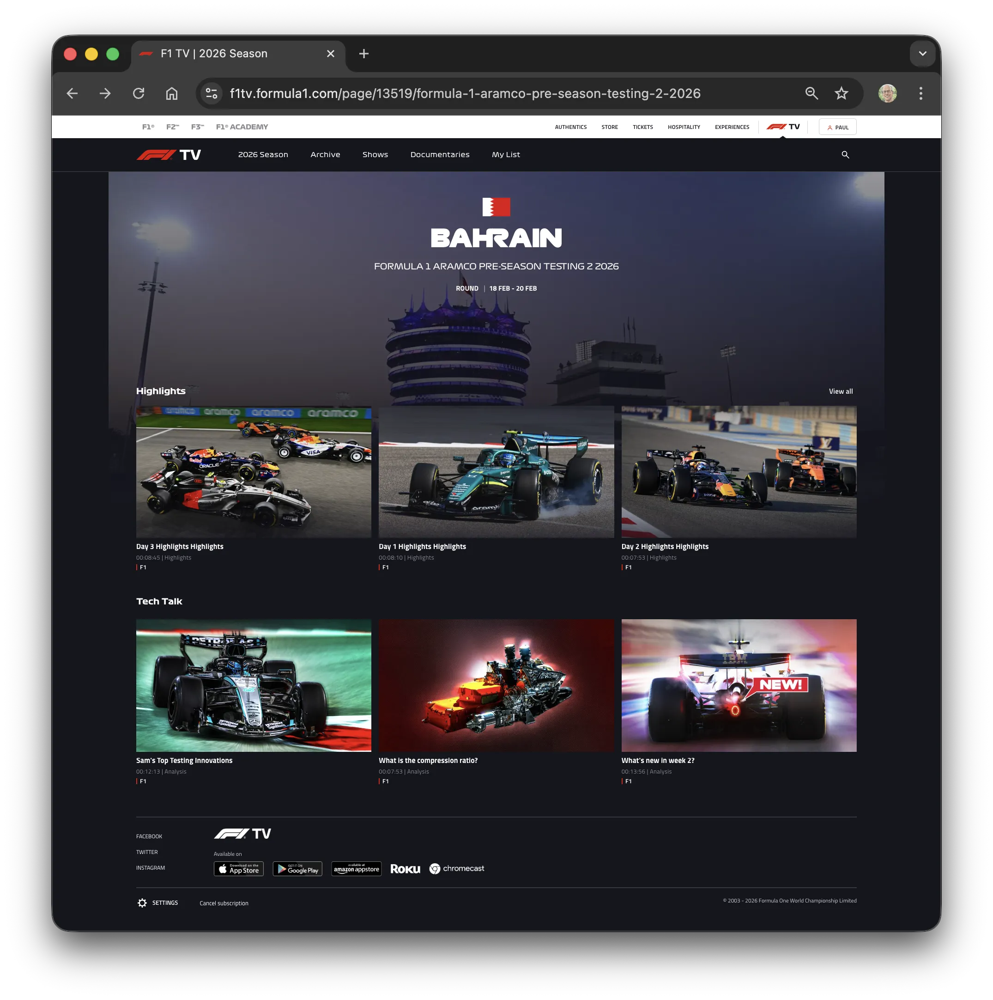
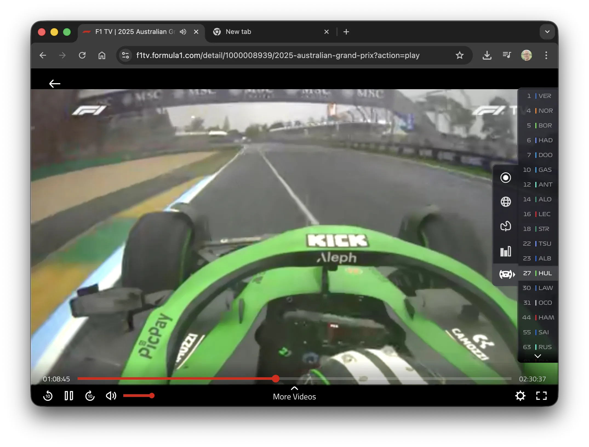
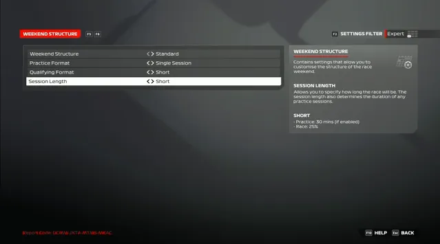

## Netflix

[Drive to Survive](https://www.netflix.com/au/title/80204890) is a great introduction to F1, where you can get to know something of the drivers and teams.
But you won't learn much about the sport itself.

## Podcasts

One of the best ways to catch up on a lot of information is via the [Shift-F1](https://podcasts.apple.com/au/podcast/shift-f1-a-formula-1-podcast/id1091772717) podcast. Every year at the beginning of the season they publish a Primer in which they'll "explain how F1 works and who everybody is, all while assuming no prior knowledge of racing". See the 2026 season primer [here](https://podcasts.apple.com/au/podcast/shift-f1-a-formula-1-podcast/id1091772717?i=1000751972438).

## F1TV

I've got a subscription to [F1TV](https://f1tv.formula1.com/) - the entry level subscription F1 TV Access for AUD35 per year - which has F1 live timing data and delayed race replays. I can't watch the current season full races - just highlights - full races become available AFTER the season has finished, in the archives section. What you do get is 30 minute highlights a couple of days after the race and slightly longer highlights than you might get on YouTube.

> Note: it's because of licensing that in Australia you can't subscribe to F1 TV Premium to see the live races (unless you use a VPN) - you need to subscribe to a different service like [Kayo](https://kayosports.com.au/sports/sport!motor/series-formula-one!30)  

Current (March 2026) content:

2025 Australian GP from the archives:

One very cool thing is if you watch a full race from the archives you can choose which driver camera to watch!

## Sim Racing 

When it comes to sim racing, the [F1](https://www.ea.com/games/f1) series from EA is not the most realistic racing title, but I have found it a lot of fun. To keep up with the latest teams, tracks and liveries, you have to buy the game each year, unfortunately. With each release, the game seems to be different in some ways, with people preferring certain releases to others.

I myself am playing F1 2024 at the moment and while it may have its faults ("Communicating with server" is one of the most frustrating things ever), I've had a lot of fun. When I started I found it VERY hard to control the car, not spin out and not crash - just completing a lap was difficult. But, with some practice I soon had all the assists off and can confidently do laps. I'm nowhere close to beating the AI in races, but I do find it fun following the real life schedule and racing on a weekend at the same venue - I'll usually do a GP weekend, with a practice session, followed by qualifying and then the race. Brilliant fun!

For Bahrain, this works out to about 27 mins practice, 16 mins qualifying and 14 laps race.
One thing I've realised with sim racing is that if races are too short, you don't have enough time to make progress - so sometimes it helps to have longer sessions if time permits.

Learning new tracks must be one of my favourite parts of sim racing - and I really do love racing the same tracks that you see in the real sport.
