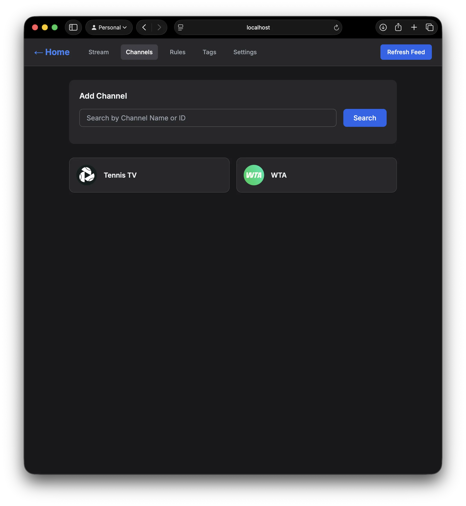
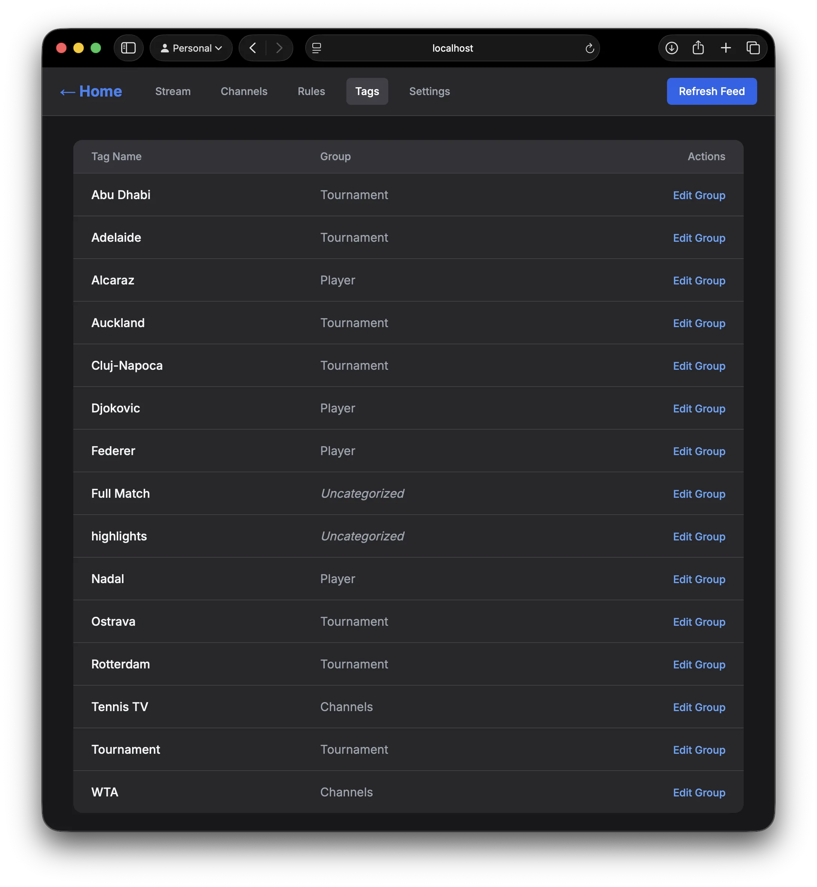

While trying to keep up with what's happening in tennis and motorsport, I found myself wondering if the experience could be better. What if I could configure a list of channels, aggregate the videos, tag those videos by looking for keywords in their titles, and then have a convenient way to filter and navigate those. 

This provides me with a feed of relevant content which I can view oldest to newest. Watched videos are marked so they disappear from the feed, allowing me to pick up where I left off.

So I built a thing... it's not there yet, but it's a start...

### Workspaces
To allow for completely different subjects, individual workspaces can be created:

### Channels
Then, add channels to a workspace:

### Rules
Define some rules to tag the videos:

### Tag groups
And group tags together:

### Stream
Then, we can view the stream of videos and filter by tags:

The workspace configuration is simply a JSON file - a workspace can be imported (and refreshed) from a URL which allows for people to share configurations easily. For example, I could define the Tennis workspace with all of the tournaments and players defined and host it in a github repository to save others the trouble!

I'm at the mercy of how well the videos themselves are titled, and I haven't got it to where I want it yet so I'll have to keep experimenting. But it's been a great exercise in rapid prototyping - having a working skeleton has helped me see what works and what doesn't without wasting too much time and effort.

